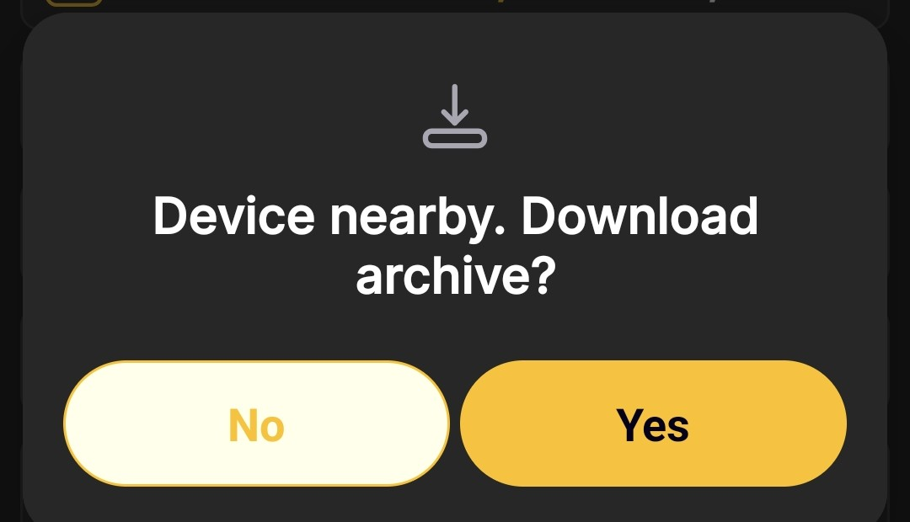

# Cómo descargar el archivo

Antes de comenzar, asegúrese de que BeeApiary La aplicación está actualizada a través de Google Play y las básculas para colmenas ejecutan el firmware lanzado en agosto de 2024 o posterior. Si la versión instalada es anterior o no está seguro de su fecha, siga [Actualizar el BeeApiary Firmware de básculas para colmenas](update-device.md).

La descarga manual de archivos es útil cuando la báscula no tiene tarjeta SIM, otros métodos de sincronización no están disponibles temporalmente o aparecen espacios en las mediciones. La aplicación importa los datos almacenados y los agrega al historial local.

!!! warning "microSD y carga de batería"
    Se debe instalar en la báscula una tarjeta microSD que funcione y que contenga los datos disponibles. Una conexión Wi-Fi directa mantiene activa la báscula y aumenta el consumo de energía, por lo que no realice este procedimiento más de una vez al día a menos que sea necesario.

1. [Activar o reiniciar el BeeApiary balanzas de colmena](../device/installation.md#activation-reset) con la llave magnética.
2. Dentro del intervalo disponible, generalmente alrededor de un minuto, conecte el teléfono a `apiary_net` y permanecer cerca de la balanza.
3. Abre el BeeApiary aplicación.
4. Espere a que la aplicación detecte automáticamente las básculas cercanas.
5. en el **"Dispositivo cercano. ¿Descargar archivo?"** mensaje, toque **si**.

    { .doc-screenshot }

6. Espere a que finalice la importación, luego desconecte inmediatamente el teléfono de `apiary_net`. Una vez desconectadas, las básculas pueden entrar en modo de suspensión y evitar un consumo innecesario de batería.
7. Vea los datos descargados usando las pantallas estándar de la aplicación.

    { .doc-screenshot }

Después de la confirmación, la aplicación descarga el archivo automáticamente y almacena una copia local de las mediciones. Si otros canales omitieron algunos datos, el archivo puede llenar los vacíos correspondientes en el historial. El formato de archivo y el período de retención se describen en [Almacenamiento de datos](../system/data-storage.md).
