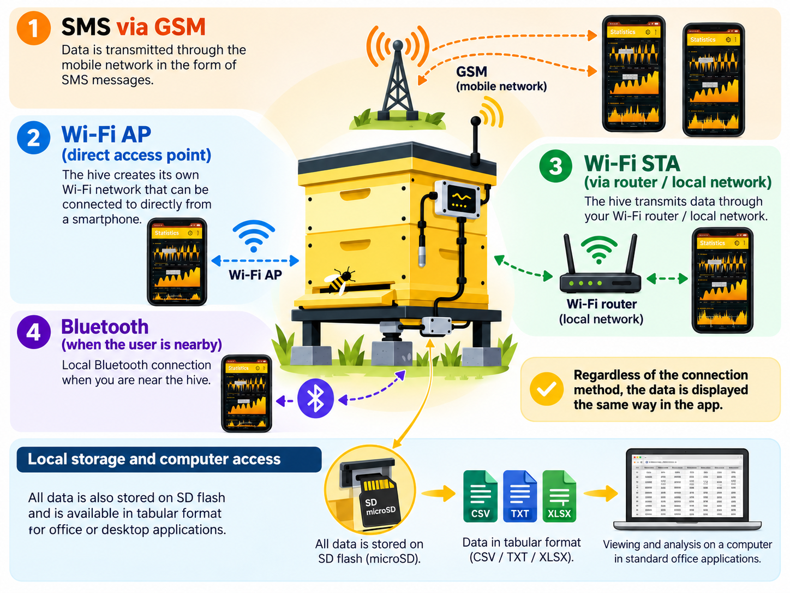
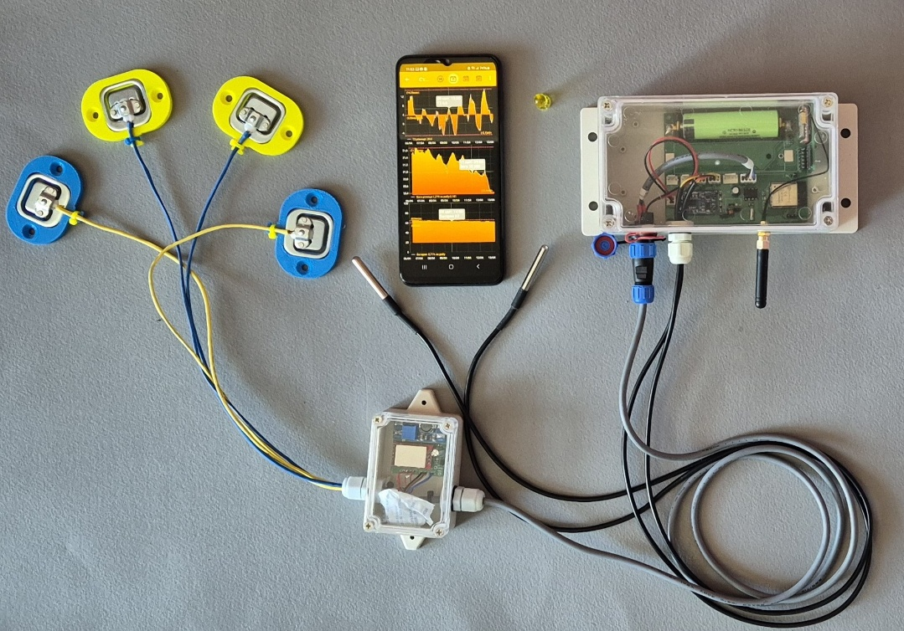

# { .home-brand-logo } BeeApiary — balanzas para colmenas y monitorización del apiario { #beeapiary }

BeeApiary combina balanzas para colmenas y un sistema de monitorización del apiario compatible con GSM, Wi-Fi y Bluetooth. Junto con los sensores y la aplicación, las balanzas permiten observar el estado de las colmenas, estudiar los cambios y llevar un diario tanto en el apiario como a distancia. La aplicación también se puede utilizar por separado, sin balanzas.

!!! note "Recursos y listados adicionales"
    - [Vídeos sobre el BeeApiary canal de youtube](https://www.youtube.com/@beeApiary)
    - [BeeApiary Balanzas para colmenas con GSM y Wi-Fi — Listado OLX](https://www.olx.ua/d/obyavlenie/vesy-pasechnye-vesy-gsm-wi-fi-dlya-paseki-IDZ7kfw.html)
    - [Apiary Scales con GSM y Wi-Fi — listado OLX](https://www.olx.ua/d/obyavlenie/vagi-paschn-apiary-scales-vesy-pasechnye-vesy-gsm-wi-fi-dlya-paseki-IDUTO1F.html)

Un conjunto puede funcionar de forma autónoma como balanzas BeeApiary y, junto con los sensores y la aplicación, formar una colmena inteligente BeeApiary. Varias de estas colmenas, reunidas en la aplicación con un diario digital, forman un apiario inteligente BeeApiary. Las distintas formas de acceder a los datos, las notas a largo plazo, las mediciones y los eventos ofrecen una visión completa de la vida del apiario y ayudan al apicultor a comprender mejor a sus abejas.

## Tus datos permanecen bajo tu control

- Todos los datos se almacenan localmente. No existe una conexión obligatoria a servidores externos, por lo que no se requiere ninguna tarjeta SIM. ([Descargar el archivo de mediciones](guides/download-archive.md))
- Los datos están disponibles directamente en el colmenar a través de una red Wi-Fi local, por lo que no se requiere tarjeta SIM. ([Conéctese al punto de acceso de la báscula](guides/configure-local-wifi.md))
- El acceso remoto a través de Internet es posible a través de la red Wi-Fi local del colmenar, por lo que no se requiere una tarjeta SIM separada para cada dispositivo. ([Configurar la transmisión a través de la red Wi-Fi del apiario](guides/configure-wifi-sync.md))
- Los datos se pueden obtener directamente a través de Bluetooth cuando estás cerca del dispositivo. La sincronización se produce automáticamente, por lo que no se requiere ninguna tarjeta SIM. ([Configurar la sincronización Bluetooth](guides/configure-bluetooth-sync.md))
- El acceso a través de un operador de telefonía móvil también sigue estando disponible y no requiere Internet móvil. Una tarjeta SIM con un plan mínimo es suficiente. ([Configurar GSM y SMS](guides/configure-gsm.md))

[Compare las formas en que los datos pueden llegar a la aplicación](system/connectivity.md)

## Empezando

- [Configurar el sistema](quick-start/full-system.md)
- [Instalar la aplicación](quick-start/app-only.md)
- [Configurar una conexión GSM al dispositivo](quick-start/gsm.md)
- [Conéctate a la red Wi-Fi local](quick-start/local-wifi.md)

## Documentación cuando la necesites

- [Usando el BeeApiary aplicación](app/index.md)
- [Instalación del BeeApiary balanzas de colmena](device/installation.md)
- [Transferir y almacenar datos](system/index.md)
- [Guías](guides/index.md)
- [Solución de problemas](troubleshooting/index.md)

{ .doc-photo }
