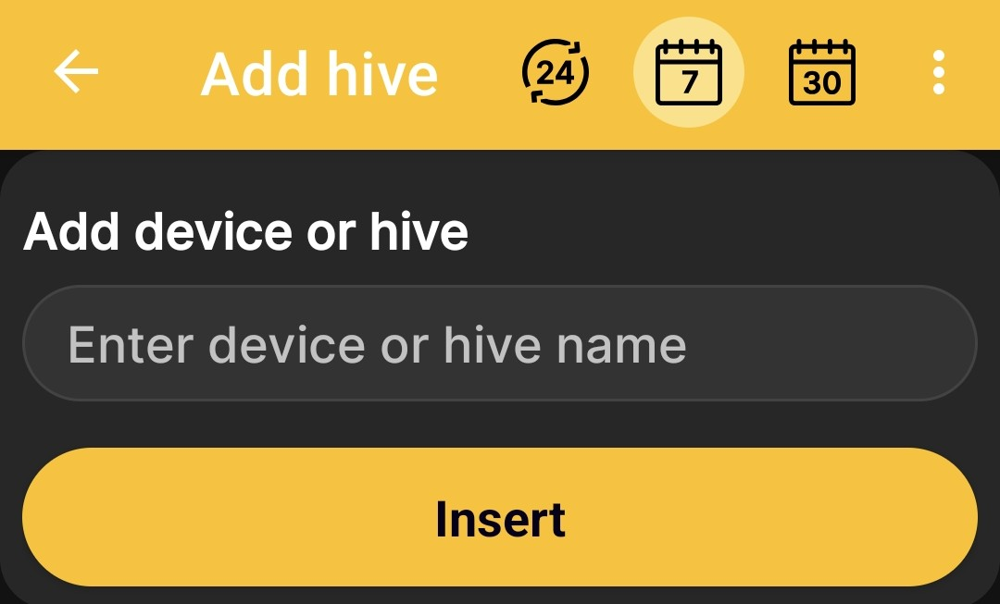

# Ajouter une ruche

Créez un profil de ruche sans balance physique pour tenir son journal, enregistrer son statut, ajouter des notes et enregistrer les événements planifiés et terminés. Ce scénario ne nécessite pas de balance pour ruche, de carte SIM ou d'autorisation pour traiter les SMS.

1. Ouvert **Menu principal → Ajouter un appareil ou une ruche**.
2. Sur le **Appareils et ruches** écran, appuyez sur **Ajouter une ruche**.
3. Entrez un nom qui vous aidera à trouver facilement cette ruche.
4. Appuyez sur **Insérer**.

    { .doc-screenshot }

Après enregistrement, le profil apparaît dans la liste partagée des appareils et des ruches. Utiliser [Statut de la ruche](hive-state.md) et [Événements et remarques](events-and-notes.md) construire son histoire dans le temps.
