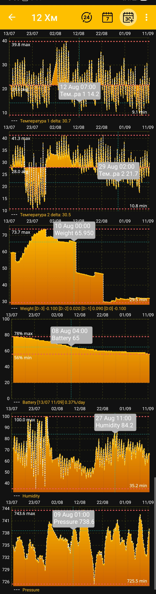

# Graphiques des mesures — suivi de la miellée et du gain de poids { #_1 }

Le graphique du poids de la ruche permet d’évaluer le gain de poids et de suivre la miellée à partir des variations quotidiennes et à long terme. Comparez ces variations aux événements et aux interventions au rucher pour suivre la miellée. L’application propose aussi des graphiques de température, d’humidité, de pression et de charge de la batterie. Les descriptions de l’état de la ruche restent dans des blocs distincts sur l’[écran principal](main-screen.md), tandis que les [événements](events-and-notes.md) peuvent apparaître comme repères temporels au-dessus des graphiques.

Après avoir sélectionné une période et une date de fin, l'application reconstruit les graphiques actifs pour cet intervalle :

{ .doc-screenshot }

## Visualisation interactive

- Appuyez sur un point sur un graphique pour afficher son heure exacte et sa valeur dans une info-bulle.
- Zoomez ou étirez les graphiques avec des gestes pour examiner une partie spécifique de la période plus en détail.
- Les marqueurs minimum et maximum vous aident à évaluer la portée en un coup d'œil.
- Les graphiques de température montrent également la valeur moyenne pour la période.
- Les graphiques d’humidité et de pression atmosphérique peuvent afficher les valeurs recommandées.
- Le graphique de la batterie indique le niveau de décharge critique et la variation quotidienne de la charge.

Les événements créés pour la ruche sélectionnée peuvent apparaître avec les mesures aux heures correspondantes. Cela vous aide à comparer le travail du rucher avec les changements de poids, de température et d’autres lectures. La visibilité des événements et l'ordre des couches sont configurés sous [Paramètres d'application supplémentaires](additional-settings.md).

Les graphiques disponibles et leur ordre dépendent des vignettes sélectionnées et des paramètres d'affichage :

- [Sélectionnez la période et la date de fin](chart-period.md)
- [Sélectionnez les données, les graphiques et leur ordre](chart-settings.md)

Des indicateurs et des outils de visualisation supplémentaires pourront être étendus dans les futures versions de l'application.
