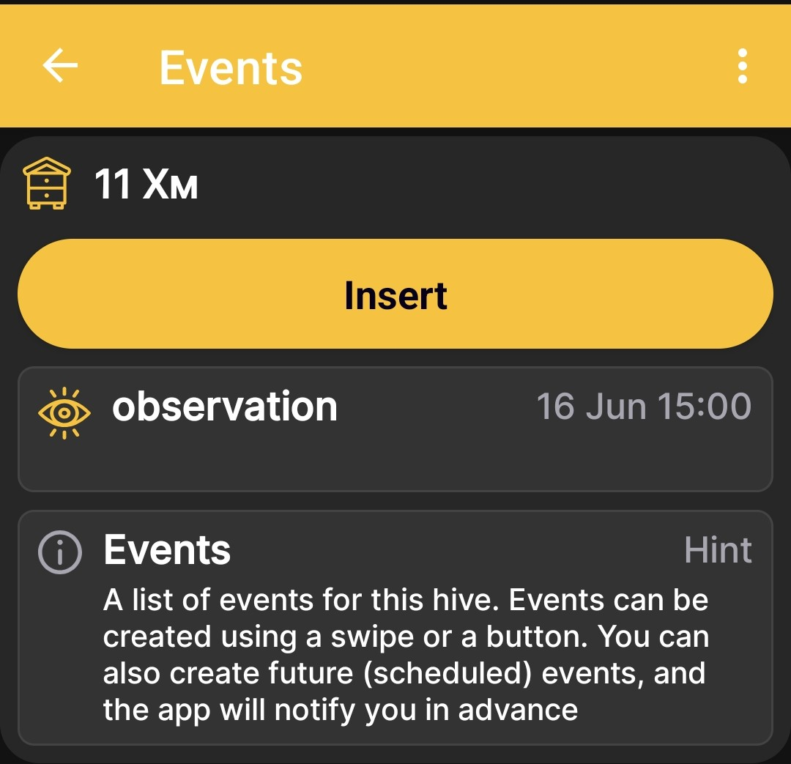
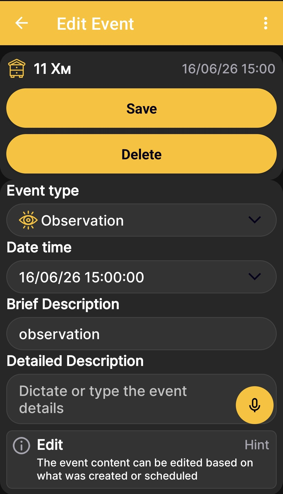
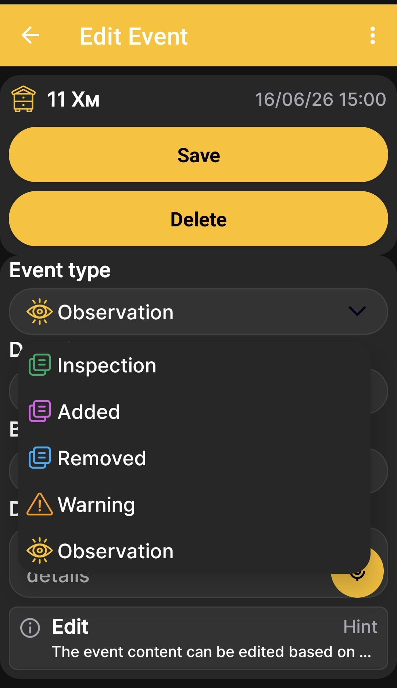

# Événements et remarques

Les événements vous aident à conserver un historique des travaux, des inspections et des observations pour chaque ruche. Pour ouvrir la liste des événements à partir du [écran d'accueil de l'application](main-screen.md), balayez vers la droite.

## Liste des événements

L'écran affiche la ruche sélectionnée et ses événements enregistrés. Chaque entrée contient une icône de type, un nom, un marqueur de couleur, ainsi que la date et l'heure. Appuyez sur **Insérer** pour créer un événement, ou sélectionnez une entrée existante pour la modifier.

{ .doc-screenshot }

Vous pouvez également créer de futurs événements programmés. L'application vous avertit à l'avance afin que le travail planifié ne se perde pas parmi les enregistrements actuels.

## Ajouter ou modifier un événement

{ .doc-screenshot }

| Élément | Fonction |
|---|---|
| **Type d'événement** | Détermine l'objectif, l'icône et le marqueur de couleur de l'entrée. |
| **Date et heure** | Enregistre quand l’événement s’est produit ou quand les travaux planifiés doivent être effectués. |
| **Brève description** | Donne un nom court à l'action terminée ou planifiée. |
| **Description détaillée** | Stocke des informations supplémentaires, des résultats d’inspection ou une note. |
| **Enregistrer** | Enregistre un nouvel événement ou vos modifications. |
| **Supprimer** | Supprime l'événement ouvert. |

!!! note "Entrée vocale"
    Un champ marqué d'une icône de microphone prend en charge la dictée. L'application convertit votre discours en texte que vous pouvez modifier, rechercher et copier ultérieurement. Il ne sauvegarde pas un enregistrement audio.

## Types d'événements

{ .doc-screenshot }

| Tapez | Quand l'utiliser |
|---|---|
| **Inspection** | Pour enregistrer les résultats d’une inspection de la ruche. |
| **Ajouté** | Pour indiquer que quelque chose a été ajouté à la ruche. |
| **Supprimé** | Pour indiquer que quelque chose a été retiré de la ruche. |
| **Avertissement** | Pour les événements qui nécessitent une attention particulière. |
| **Observations** | Pour enregistrer une condition ou un événement observé. |

Les types d'événements ont des couleurs et des icônes différentes. Sur le [graphiques](charts.md), les événements apparaissent avec des horodatages et sont positionnés en fonction du moment où ils se sont produits. Cela vous aide à comparer le travail du rucher avec les changements de poids, de température et d’autres mesures.
