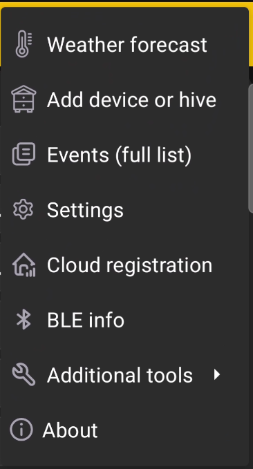

# Menu principal

Ouvrez le menu dans le coin supérieur droit de l'écran principal pour accéder aux fonctionnalités générales de l'application.

{ .doc-screenshot }

| Élément de menu | Fonction |
|---|---|
| **Prévisions météorologiques** | Affiche les prévisions météorologiques pour les travaux du rucher. |
| **Ajouter un appareil ou une ruche** | Ouvre l'option d'ajouter [BeeApiary balances pour ruches](add-device.md) ou un séparé [profil de ruche](add-hive.md). |
| **Événements (liste complète)** | Ouvre [événements et notes](events-and-notes.md) pour toutes les ruches. |
| **Paramètres** | Ouvre le général [paramètres de l'application](settings/index.md). |
| **Inscription dans le cloud** | Prépare l'appareil pour [synchronisation via le réseau Wi-Fi du rucher](../guides/configure-wifi-sync.md). |
| **BLE info** | Ouvre des informations sur [synchronisation via Bluetooth](../system/bluetooth.md). |
| **Outils supplémentaires** | Ouvre [outils de sauvegarde, de restauration et d'exportation des journaux de service](additional-tools.md). |
| **À propos** | Montre le [description, liens utiles et version installée](about.md). |
