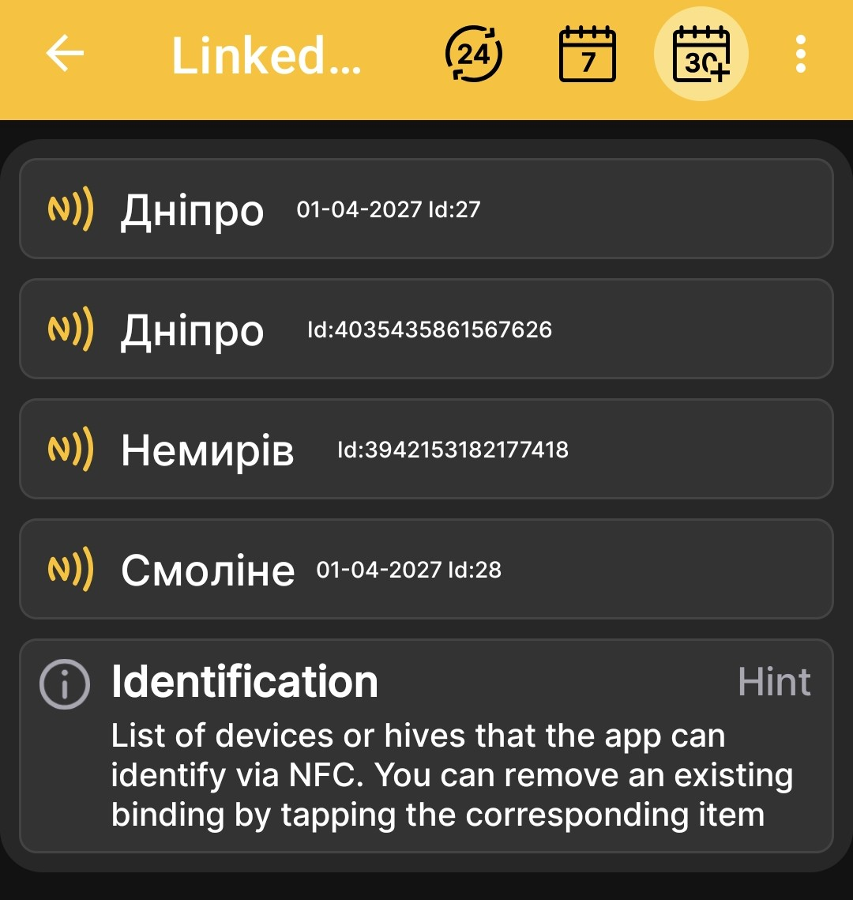
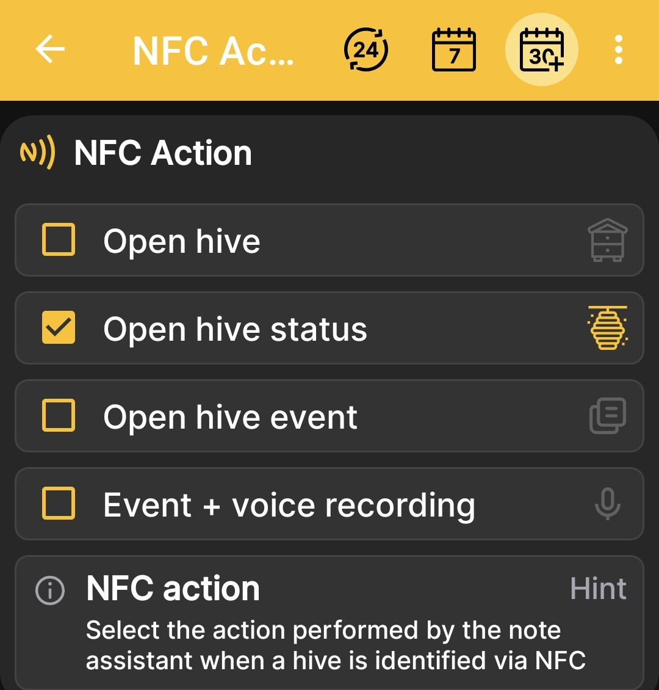

# Balises et actions NFC

Les paramètres NFC se composent de deux écrans liés : la liste des balises liées et l'action effectuée par l'application après avoir reconnu une ruche.

## Qu'est-ce qu'une balise NFC ?

Un tag NFC est un petit identifiant électronique. Il peut s'agir d'un porte-clés, d'une pièce de monnaie, d'un autocollant, d'une carte NFC standard ou d'une carte spéciale ruche. Fixez l'étiquette à la ruche dans un endroit pratique pour la numérisation, comme sous le toit ou sur un mur.

Lorsque vous tenez un téléphone compatible NFC à proximité de l'étiquette, l'application identifie rapidement la ruche spécifique et exécute l'action sélectionnée : elle ouvre les détails, l'état ou les événements de la ruche, ou commence immédiatement à créer un événement à l'aide de la saisie vocale.

Il vous suffit de lier une seule fois un tag compatible au profil de la ruche et de le laisser sur la ruche. Cela réduit le temps nécessaire pour trouver le profil correct et permet de conserver un historique plus complet sans notes papier séparées.

!!! info "Une note vocale devient du texte"
    L'application fait plus que sauvegarder un enregistrement vocal : elle convertit la note dictée en texte. Ceci est particulièrement pratique lorsque vous travaillez avec des gants de protection, pendant les travaux d'élevage ou lors de l'inspection de plusieurs ruches en séquence. Vous pouvez ensuite réviser, rechercher, traiter et copier le texte chaque fois que nécessaire.

## Balises NFC liées { #linked-nfc-tags }

Ouvert **Menu principal → Paramètres → Liste des balises NFC** pour visualiser les appareils ou les ruches que l'application peut identifier via NFC.

{ .doc-screenshot }

La liste affiche le nom et l'identifiant de chaque profil lié. Appuyer sur la vignette correspondante supprime le lien NFC.

!!! info "Liste des appareils et des ruches"
    Dans la liste des appareils et des ruches, une icône NFC distincte indique qu'un tag est lié. Un lien direct vers la description complète de cet écran sera ajouté une fois son examen terminé.

## Action après reconnaissance { #nfc-action }

Ouvert **Menu principal → Paramètres → Action NFC** et sélectionnez ce que l'application doit ouvrir après avoir reconnu une balise NFC.

{ .doc-screenshot }

Actions disponibles :

- **Ruche ouverte**;
- **Statut de la ruche ouverte**;
- **Événement de ruche ouverte**;
- **Événement + enregistrement vocal**.

La dernière option ouvre immédiatement la création d'événements avec saisie vocale une fois la ruche identifiée.
