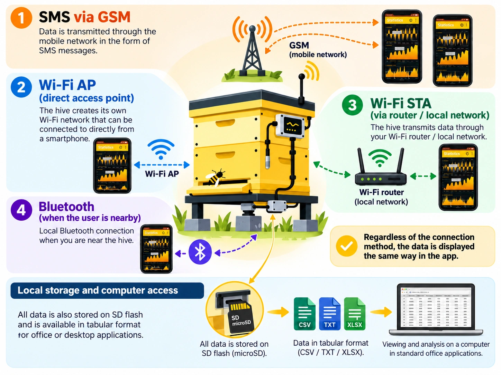

# { .home-brand-logo width="780" height="780" } BeeApiary — balances de ruche et suivi du rucher { #beeapiary }

BeeApiary associe des balances de ruche à un système de suivi du rucher compatible avec GSM, Wi-Fi et Bluetooth. Avec les capteurs et l’application, les balances permettent de suivre l’état des ruches, d’étudier les changements et de tenir un journal au rucher comme à distance. L’application peut aussi être utilisée seule, sans balance.

!!! note "Modèles de balances"
    - [Balances pour ruches avec GSM, Wi-Fi et Bluetooth](https://www.olx.ua/d/obyavlenie/vagi-paschn-apiary-scales-vesy-pasechnye-vesy-gsm-wi-fi-dlya-paseki-IDUTO1F.html)
    - [Balances pour ruches avec GSM, Wi-Fi et Bluetooth et un « petit plus »](https://www.olx.ua/d/obyavlenie/vesy-pasechnye-vesy-gsm-wi-fi-dlya-paseki-IDZ7kfw.html "Le « petit plus » désigne le support en forme de croix")

{ width="1448" height="1086" loading="eager" fetchpriority="high" }

!!! note "Vidéos complémentaires"
    - [Des vidéos sur le BeeApiary Chaîne YouTube](https://www.youtube.com/@beeApiary)

Un ensemble peut fonctionner de manière autonome comme balance BeeApiary et, avec les capteurs et l’application, former une ruche intelligente BeeApiary. Plusieurs de ces ruches réunies dans l’application avec un journal numérique constituent un rucher intelligent BeeApiary. Les différents modes d’accès aux données, les notes conservées dans le temps, les mesures et les événements donnent une vue d’ensemble de la vie du rucher et aident l’apiculteur à mieux comprendre ses abeilles.

## Vos données restent sous votre contrôle

- Toutes les données sont stockées localement. Il n'y a pas de connexion obligatoire à des serveurs externes, donc aucune carte SIM n'est requise. ([Téléchargez les archives de mesures](guides/download-archive.md))
- Les données sont disponibles directement au rucher via un réseau Wi-Fi local, aucune carte SIM n'est donc requise. ([Connectez-vous au point d’accès de la balance](guides/configure-local-wifi.md))
- L'accès à distance via Internet est possible via le réseau Wi-Fi local du rucher, une carte SIM distincte n'est donc pas requise pour chaque appareil. ([Configurer la transmission via le réseau Wi-Fi du rucher](guides/configure-wifi-sync.md))
- Les données peuvent être obtenues directement via Bluetooth lorsque vous êtes à proximité de l'appareil. La synchronisation s'effectue automatiquement, aucune carte SIM n'est donc requise. ([Configurer la synchronisation Bluetooth](guides/configure-bluetooth-sync.md))
- L'accès via un opérateur mobile reste également disponible et ne nécessite pas d'Internet mobile. Une carte SIM avec un forfait minimal suffit. ([Configurer GSM et SMS](guides/configure-gsm.md))

[Comparez les manières dont les données peuvent atteindre l'application](system/connectivity.md)

## Commencer

- [Configurer le système](quick-start/full-system.md)
- [Installez l'application](quick-start/app-only.md)
- [Établir une connexion GSM à l'appareil](quick-start/gsm.md)
- [Connectez-vous au réseau Wi-Fi local](quick-start/local-wifi.md)

## De la documentation quand vous en avez besoin

- [En utilisant le BeeApiary application](app/index.md)
- [Installation du BeeApiary balances pour ruches](device/installation.md)
- [Transfert et stockage de données](system/index.md)
- [Guides](guides/index.md)
- [Dépannage](troubleshooting/index.md)

{ .doc-photo width="1079" height="754" loading="lazy" decoding="async" }
