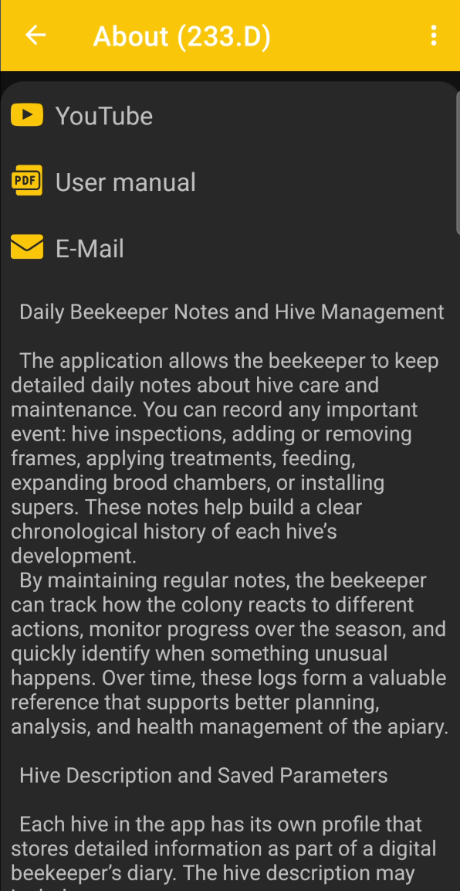
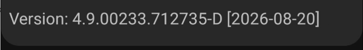

# O aplikacji

 **O aplikacji** strona zawiera krótki przegląd BeeApiary, przydatne linki i szczegóły dotyczące zainstalowanej wersji.

{ .doc-screenshot }

Strona zapewnia dostęp do:

- **YouTube** - przewodniki wideo dotyczące konfiguracji i użytkowania;
- **Instrukcja obsługi** - BeeApiary dokumentacja tekstowa;
- **E-mail** - kontakt z supportem poprzez e-mail;
- krótki przegląd funkcji aplikacji i dziennika pasiecznego.

## Wersja aplikacji

Identyfikator wersji i data kompilacji są wyświetlane na dole strony.

{ .doc-screenshot }

Informacje te pomogą Ci sprawdzić, czy aplikacja jest aktualna i określić dokładną wersję, kontaktując się z pomocą techniczną.
