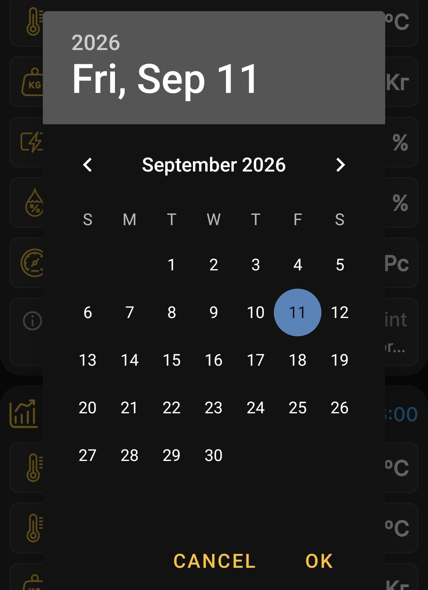

# Okres przeglądania wykresu

Krótko dotknij wybranego nagłówka ula na ekranie głównym, aby otworzyć wykresy.

## Długość okresu

Ikony dnia, tygodnia i miesiąca ustawiają jednostkę okresu. Naciśnij kilkakrotnie odpowiednią ikonę, aby wybrać kolejno 1, 2, 3 lub więcej dni, tygodni lub miesięcy.

## Data zakończenia

Stuknij datę i godzinę u góry wybranego panelu ula, a następnie wybierz żądaną datę w kalendarzu. Jest to data końcowa interwału; aplikacja oblicza datę rozpoczęcia na podstawie wybranej długości okresu.

Na przykład, jeśli wybierzesz **4 września** jako data końcowa i **jeden miesiąc** jako okres, z którego wykresy przedstawiają dane **Od 4 sierpnia do 4 września**.

{ .doc-screenshot }

Możesz wybrać dowolną dostępną datę zakończenia, w tym datę sprzed roku. Dzięki temu możesz przeglądać starsze pomiary i zdarzenia, gdy odpowiednie dane są dostępne w aplikacji.

Po dokonaniu wyboru aplikacja odbudowuje plik [wykresy](charts.md) dla wybranego interwału.
