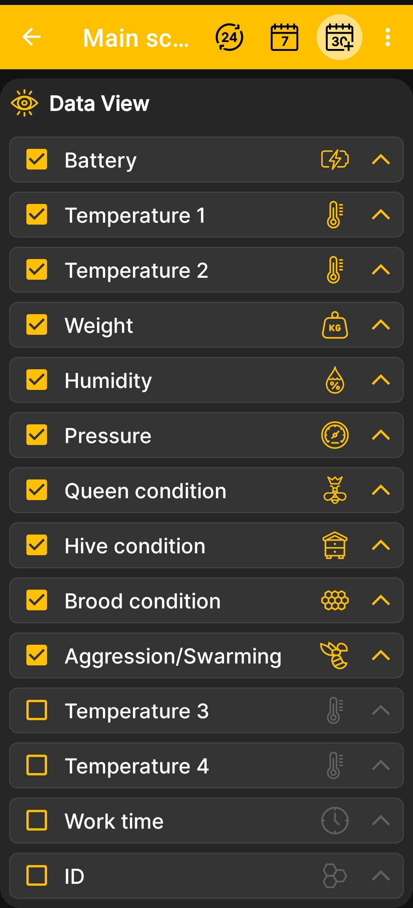

# Wybierz Dane i wykresy

 **Kolejność na ekranie głównym** określa, które kafelki pojawiają się na ekranie głównym i w jakiej kolejności, a także które wykresy pojawiają się na ekranie wykresów i w jakiej kolejności. Wykresy są dostępne tylko dla wartości liczbowych zmieniających się w czasie.

1. Otwórz **Menu główne → Ustawienia → Kolejność ekranów głównych**.
2. Zaznacz pola wyboru obok danych, które chcesz wyświetlić.
3. Wyczyść pola wyboru obok płytek, których nie potrzebujesz.
4. Użyj strzałek po prawej stronie, aby przenieść najważniejsze wartości wyżej.

{ .doc-screenshot }

Po powrocie do [ekran główny](main-screen.md), aplikacja korzysta z wybranego zestawu i kolejności płytek. Na [wykresy](charts.md) ekranie te same ustawienia określają, które wykresy będą dostępne dla wybranych wartości liczbowych i ich kolejność.

Skonfigurowano szczegółowe pola stanu ula [na oddzielnym ekranie](hive-state-settings.md). Widoczność zdarzeń oraz kolejność rysowania zdarzeń i wykresów są kontrolowane w programie [dodatkowe ustawienia aplikacji](additional-settings.md).
