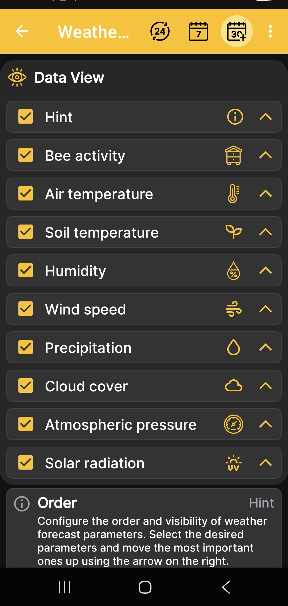

# Kolejność danych ekranu pogodowego

Ten ekran określa, jakie dane są wyświetlane w prognozie pogody i w jakiej kolejności się one pojawiają.

1. Otwórz **Menu główne → Ustawienia → Kolejność ekranów pogody**.
2. Zaznacz lub wyczyść pola wyboru obok wymaganych wartości.
3. Użyj strzałek po prawej stronie, aby przenieść najważniejsze dane wyżej.

{ .doc-screenshot }

Dostępne wartości obejmują wskazówkę, aktywność pszczół, temperaturę powietrza i gleby, wilgotność, prędkość wiatru, opady, zachmurzenie, ciśnienie atmosferyczne i promieniowanie słoneczne.

To ustawienie dotyczy prognozy pogody w aplikacji na Androida. Nie włącza ani nie wyłącza fizycznych czujników BeeApiary wagi do ula.
