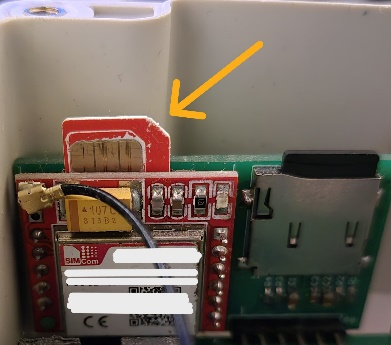
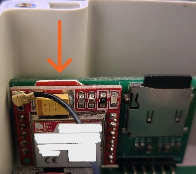
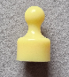

# Jak zamontować wagę pasieczną pod ulem { #_1 }

Aby zainstalować wagę pod ulem, należy umieścić jednostkę główną w osłoniętym miejscu, a czujniki masy na stabilnych podporach. Poniższe kroki obejmują instalację i pierwszą aktywację programu BeeApiary wagi do ula.

1. Wybierz osłonięte miejsce pod nawisem lub osłoną ula.
2. Umieść jednostkę główną tak, aby zminimalizować narażenie na bezpośrednie działanie promieni słonecznych, deszczu i śniegu.
3. Zamontuj czujniki ciężaru na stabilnych wspornikach w tej samej płaszczyźnie poziomej.
4. Rozmieść czujniki temperatury zgodnie z potrzebami monitorowania.
5. Jeśli będziesz korzystać z sieci GSM, zainstaluj kartę micro-SIM z wyłączoną ochroną PIN.

    Prawidłowa orientacja karty:

    { .doc-photo }

    Włóż kartę SIM i delikatnie wciśnij ją prawie całkowicie do gniazda, aż usłyszysz delikatne kliknięcie potwierdzające, że karta została zablokowana na swoim miejscu:

    { .doc-photo }

6. Aktywuj lub uruchom ponownie urządzenie kluczem magnetycznym i sprawdź pierwszy pomiar.

## Aktywacja i ponowne uruchomienie { #activation-reset }

Pierwsza aktywacja i ponowne uruchomienie odbywa się w ten sam sposób: krótko przytrzymaj klucz magnetyczny przy markowym znaku z tyłu jednostki głównej. Nie ma potrzeby dotykania innych części obudowy ani otwierania urządzenia.

{ .doc-photo }

{ .doc-photo }

!!! danger
    Nie instaluj urządzenia ani anteny zewnętrznej w najwyższym punkcie pasieki. Stwarza to ryzyko porażenia piorunem i nieodwracalnych szkód.

Aby uzyskać więcej informacji, zobacz [Umieszczenie](placement.md) i [Czujniki](sensors.md).
