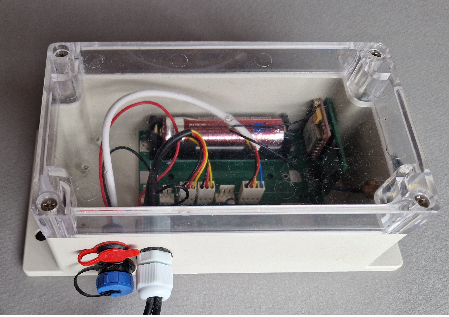

# Konfiguracja systemu

!!! danger "Uwaga: urządzenie jest już w pełni skonfigurowane"
    Nowy BeeApiary Wagi do ula są dostarczane skonfigurowane i skalibrowane. Numer użytkownika jest już zapisany w ustawieniach wagi, więc nie ma potrzeby jego ponownej konfiguracji.

    Nie wprowadzaj zmian samodzielnie. Zwykle wystarczy wykonać tylko pierwsze cztery poniższe kroki, aby wszystko zadziałało.

    Nie wyjmuj baterii, nie taruj, nie kalibruj wagi ani nie zmieniaj żadnych ustawień bez uprzedniego przeczytania do końca odpowiednich instrukcji. Zdecydowanie odradza się robienie tego podczas wstępnej konfiguracji.

!!! warning "Przed instalacją karty SIM"
    Używaj wyłącznie karty micro-SIM i wcześniej wyłącz jej zabezpieczenie PIN-em.

1. Otwórz pokrywę modułu gromadzenia danych.

    { .doc-photo }

2. Włóż kartę micro-SIM do odpowiedniego gniazda.

    Prawidłowa pozycja karty:

    { .doc-photo }

    Włóż kartę SIM i delikatnie ją dociśnij, aż zostanie prawie całkowicie wsunięta w gniazdo i usłyszysz lekkie kliknięcie potwierdzające, że karta została zablokowana na swoim miejscu:

    { .doc-photo }

3. [Aktywuj lub uruchom ponownie urządzenie](../device/installation.md#activation-reset): krótko przyciśnij klucz magnetyczny do oznaczenia marki z tyłu jednostki głównej.

    { .doc-photo }

    { .doc-photo }

4. Poczekaj około minuty i potwierdź, że pierwsza wiadomość SMS dotrze na wstępnie skonfigurowany numer użytkownika.

Gotowe. Gratulacje: urządzenie zbiera dane, wysyła je przez GSM i prowadzi lokalne archiwum.

## Aplikacja — w razie potrzeby

 BeeApiary aplikacja nie jest wymagana do odbierania zwykłych wiadomości SMS. Zainstaluj ją, jeśli chcesz automatycznie odbierać dane z urządzenia, przeglądać pomiary i korzystać z innych funkcji aplikacji.

1. [Zainstaluj BeeApiary aplikacja](app-only.md) i upewnij się, że udzieliłeś mu pozwolenia na przetwarzanie wiadomości SMS.
2. W aplikacji wybierz **Dodaj urządzenie**.
3. Wprowadź numer karty micro-SIM zainstalowanej w BeeApiary wagi do ula.

!!! note
    Wprowadź numer karty SIM zainstalowanej w urządzeniu, a nie numer telefonu użytkownika.

Jeśli pierwszy SMS nie dotrze, nie zmieniaj ustawień losowo. Zobacz [Nie otrzymano SMS-a](../troubleshooting/no-sms.md). Zmień numer użytkownika poprzez [Ustawienia GSM](../guides/configure-gsm.md) tylko wtedy, gdy jest to konieczne.

[Wideo: instalowanie karty SIM](https://www.youtube.com/shorts/GF2KLso4DMo)

Dowiedz się więcej: [GSM i SMS-y](../system/gsm-and-sms.md) i [Przepływ danych](../system/data-flow.md).
