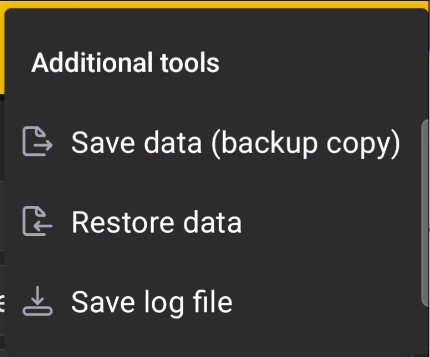

# Ferramentas Adicionais

O **Ferramentas adicionais** O submenu contém comandos para backup de dados e diagnóstico de serviço.

{ .doc-screenshot }

| Comando | Função |
|---|---|
| **Salvar dados (cópia de backup)** | Cria uma cópia de backup do banco de dados do aplicativo. |
| **Restaurar dados** | Restaura dados de aplicativos de uma cópia de backup criada anteriormente. |
| **Salvar arquivo de registro** | Salva um arquivo de log de serviço que você pode enviar ao suporte para diagnóstico. |

!!! warning "Mantenha uma cópia de backup atualizada"
    Antes de restaurar, certifique-se de ter selecionado a cópia necessária dos dados. Salve o backup atual separadamente se precisar restaurá-lo mais tarde.
