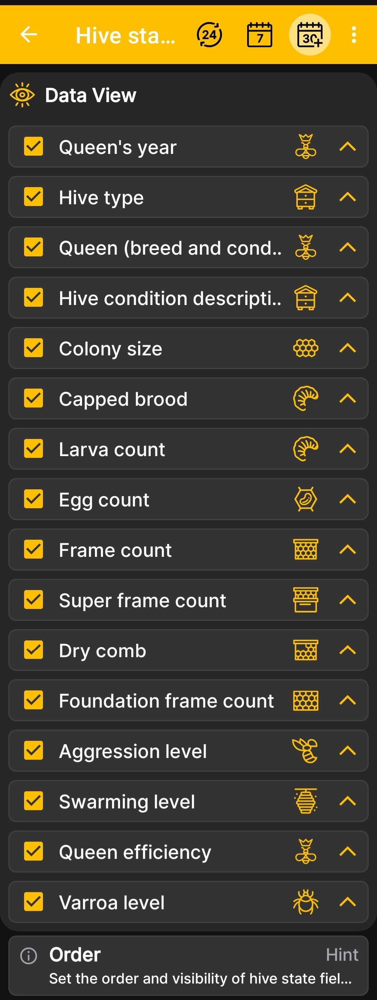

# Ordem de campo do estado da colmeia

Esta tela controla a visibilidade e a ordem dos campos no campo expandido [estado de colmeia](hive-state.md).

1. Abrir **Menu principal → Configurações → ordem dos campos de estado da colmeia**.
2. Mantenha as caixas de seleção marcadas ao lado das informações que deseja exibir.
3. Desmarque as caixas de seleção dos campos que não são usados em seu apiário.
4. Use as setas à direita para mover os campos mais importantes para cima.

{ .doc-screenshot }

Você pode configurar a exibição do ano e condição da rainha, tipo e descrição da colmeia, tamanho da colônia, ninhada, larvas, ovos, diferentes tipos de estrutura, agressão, enxameação, produtividade da rainha e nível de varroa.

Alterar a ordem afeta a forma como os dados são apresentados no aplicativo, mas não altera os registros armazenados da colmeia.
