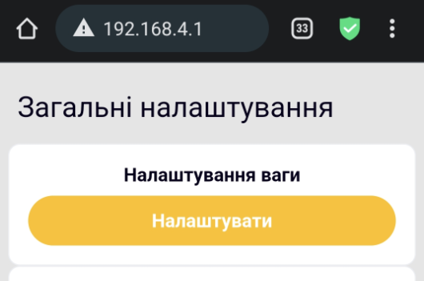
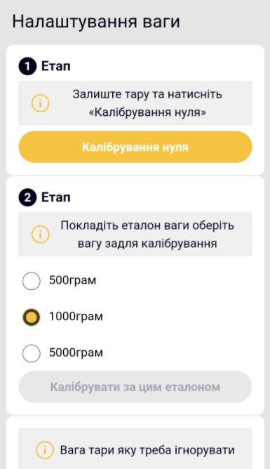
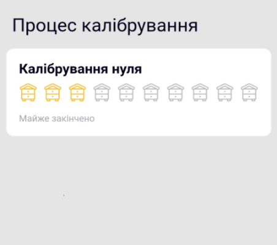
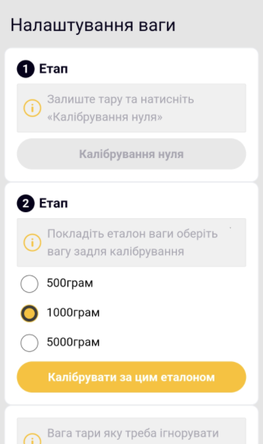
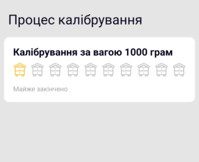
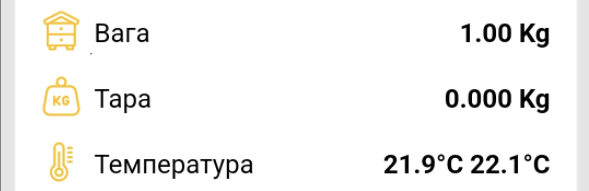
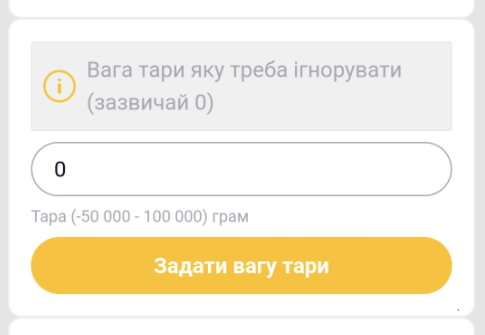
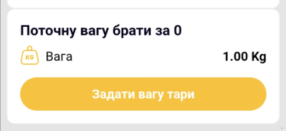

# Calibração e Tara

!!! danger "Um novo dispositivo não precisa de calibração"
    A calibração é necessária principalmente após um reparo ou perda de dados de calibração de fábrica. Não use isso como uma forma geral de solucionar uma leitura incorreta de peso.

## Calibração

1. Desconecte a fonte de alimentação externa.
2. Coloque todos os sensores de peso sobre uma superfície firme e nivelada e deixe a plataforma vazia.
3. Conecte-se ao ponto de acesso do dispositivo e abra **Configurações Gerais → Configurações da balança** em sua interface web.

    { .doc-screenshot }

4. Começar **Calibração Zero** e espere terminar sem tocar na plataforma.

    A tela mostra dois estágios de calibração:

    { .doc-screenshot }

    { .doc-screenshot }

5. Selecione um peso de referência disponível de 500, 1.000 ou 5.000 g e coloque-o na plataforma.

    { .doc-screenshot }

6. Começar **Calibração de Referência** e espere pelo resultado.

    { .doc-screenshot }

    { .doc-screenshot }

## Tara

Você pode inserir um peso de tara conhecido em gramas:

{ .doc-screenshot }

Alternativamente, aceite o peso atual da plataforma como zero:

{ .doc-screenshot }

A tara não altera o fator de calibração de fábrica.

Procedimentos separados: [Tarar a balança](../guides/tare-scales.md) e [Calibrar as balanças](../guides/calibrate-scales.md).
