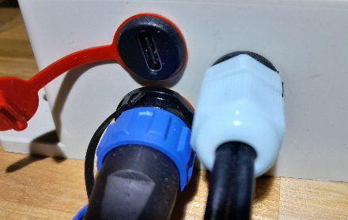
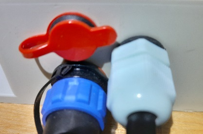

# Energia e carregamento

O dispositivo opera a partir de uma ou duas células 18650 e carrega através de USB Type-C. A fonte de energia pode ser um carregador, um banco de energia ou um painel solar opcional.

!!! note "Escolhendo um carregador e cabo"
    O dispositivo não suporta carregamento rápido, incluindo USB Power Delivery (PD). Use uma fonte de alimentação padrão com uma porta USB Tipo A e um cabo USB Tipo A–USB Tipo C. Um cabo USB Type-C – USB Type-C não é recomendado para carregamento.

{ .doc-photo }

Feche a tampa protetora da porta após o carregamento:

{ .doc-photo }

- o indicador azul permanece aceso quando a bateria está totalmente carregada e a alimentação externa ainda está conectada;
- o nível de cobrança é mostrado nas mensagens SMS e nas configurações gerais da interface web;

  { .doc-screenshot }

- abaixo de 20%, o dispositivo entra no modo de economia de energia, interrompe medições regulares e mensagens SMS e verifica periodicamente o nível de carga;
- após uma descarga crítica, a bateria se desconecta automaticamente e [sincronização de tempo](../system/time-synchronization.md) pode ser necessário após o carregamento.

!!! warning "Após armazenamento a longo prazo"
    Se a tensão da bateria estiver abaixo `3,5 В`, não tente restaurar o dispositivo usando apenas a porta USB. Siga o [procedimento de recuperação após armazenamento a longo prazo](../troubleshooting/recovery-after-storage.md).

!!! danger
    Não use o dispositivo sem uma célula 18650 instalada. Observe rigorosamente a polaridade ao substituí-lo: a polaridade incorreta danificará o dispositivo.
