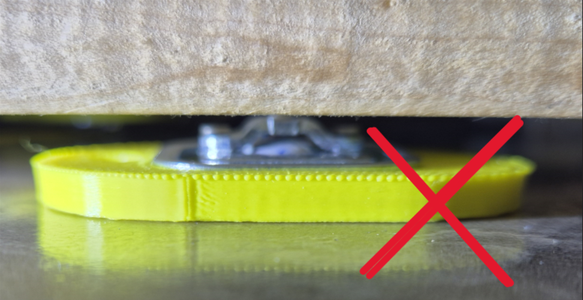
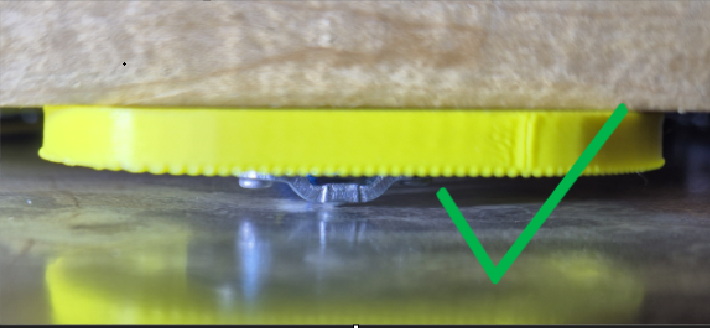

# Sensores

## Peso

Coloque os quatro sensores de peso sob os cantos do fundo da colmeia. A parte plástica de cada sensor deve ficar voltada para cima e o suporte metálico inferior deve repousar sobre uma superfície firme e plana. Não coloque os sensores diretamente no solo ou em uma base de madeira macia. A colmeia não deve balançar.

Um suporte inadequado causa desalinhamento e distorce as medições:

{ .doc-photo }

A parte metálica do sensor deve repousar sobre uma superfície firme e plana:

{ .doc-photo }

Os sensores são resistentes à umidade, mas não se destinam à imersão parcial ou completa em água.

## Temperatura

Um arranjo típico coloca um sensor dentro ou acima da colmeia e o outro fora ou abaixo dela. Você pode alterar suas localizações de acordo com o objetivo da observação.

## Opções Adicionais

- o sensor de movimento é instalado na lateral da unidade principal e detecta movimento a uma distância de 5–7 m dentro de um setor de 120–150°;
- o display OLED mostra peso, temperaturas e carga da bateria e acende durante a medição ou quando ativado com chave magnética;
- sensores meteorológicos podem adicionar leituras adicionais de umidade, pressão e temperatura.

A presença do display OLED, sensor meteorológico e entrada de alarme é especificada no [configurações adicionais do dispositivo](additional-settings.md).
