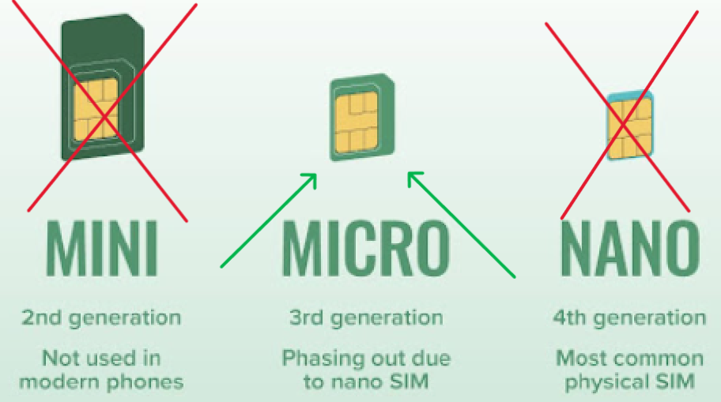

# Conectando ao dispositivo via GSM

!!! warning
    Use um cartão micro SIM. Desative a proteção do PIN do cartão SIM antecipadamente.

    { .doc-photo }

1. [Instale o BeeApiary aplicativo](app-only.md) se necessário. Não é necessário receber mensagens SMS comuns. Se o aplicativo precisar processar dados de medição de mensagens SMS automaticamente, a permissão do SMS será obrigatória.
2. Abra a tampa da unidade de coleta de dados.

    { .doc-photo }

3. Insira o micro-SIM no slot apropriado.

    Posição correta do cartão:

    { .doc-photo }

    Insira o cartão SIM e pressione-o suavemente até que esteja quase totalmente encaixado no slot e você ouça um leve clique confirmando que está travado no lugar:

    { .doc-photo }

4. Ative ou reinicie o dispositivo da mesma forma: segure brevemente a chave magnética contra a marca da marca na parte traseira da unidade principal.

    { .doc-photo }

    { .doc-photo }

5. Espere cerca de um minuto.
6. Confirme se o primeiro SMS chega ao número pré-configurado.

Pronto: o aparelho foi ativado ou reiniciado e pode enviar medições via GSM.

Se o número do proprietário ainda não tiver sido configurado, [configure o número através da rede Wi-Fi local](../guides/configure-gsm.md).

[Vídeo: instalando o cartão SIM](https://www.youtube.com/shorts/GF2KLso4DMo)
