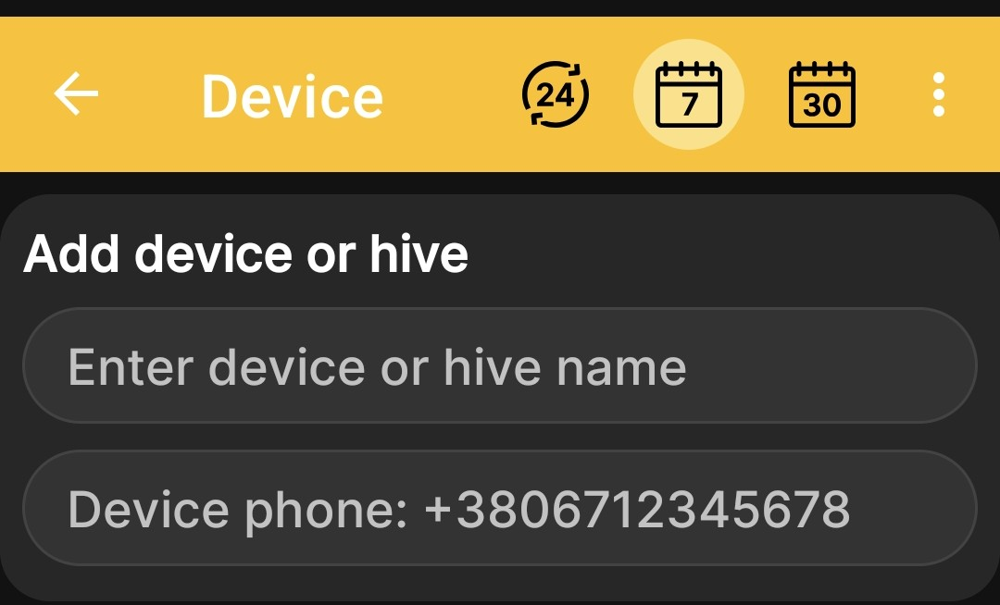
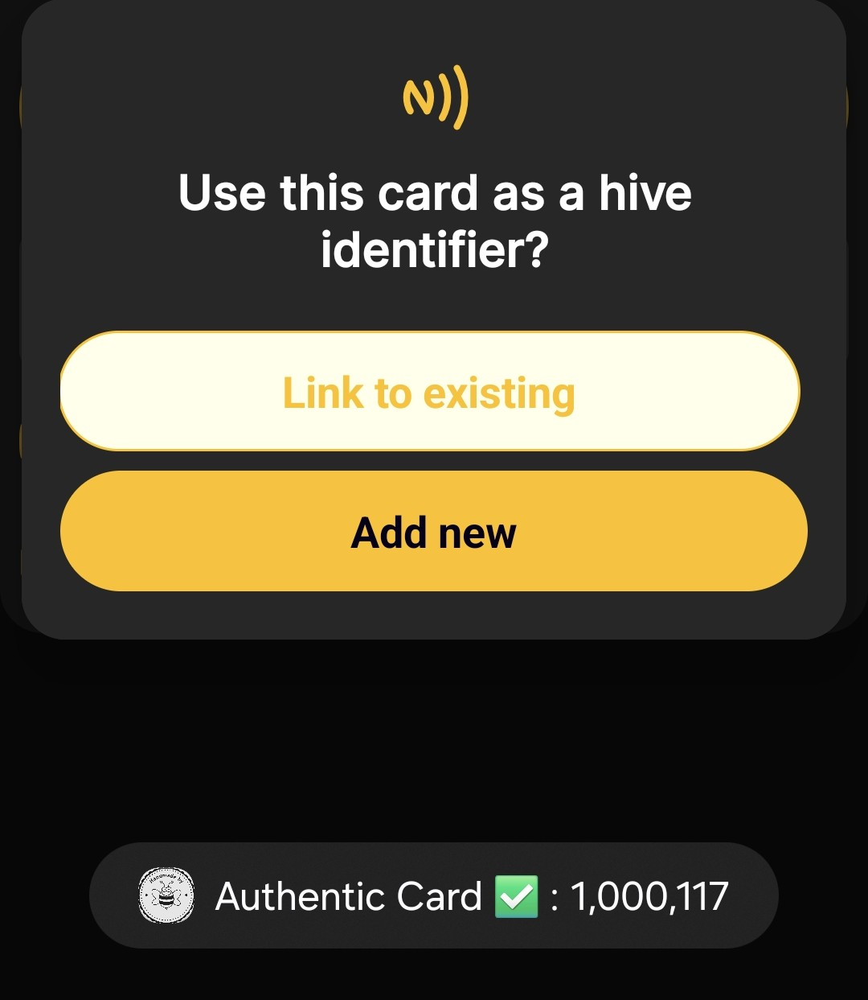
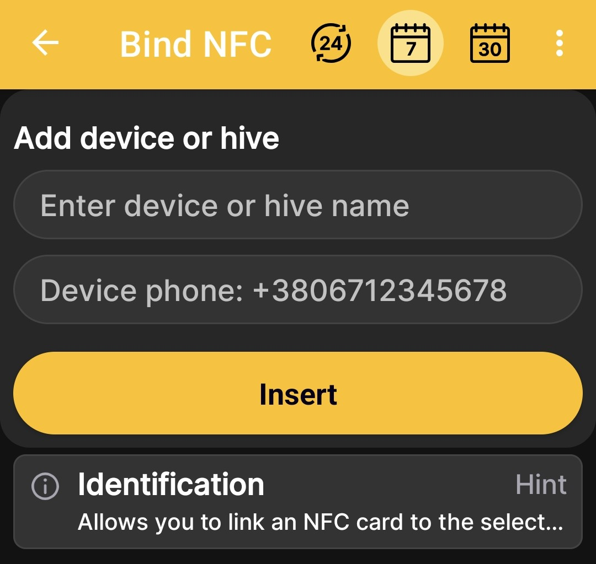

# BeeApiary kovan tartısı ekleme

Ekle BeeApiary Bir arı kovanı profilini fiziksel ekipmana bağlamak ve otomatik okumalar almak için arı kovanı tartım terazileri. Mevcut veri kanalları ve gereksinimleri aşağıda açıklanmıştır. [Uygulamada Veri Alma](../system/connectivity.md).

## Tartı terazilerini ekleyin

1. Açık **Ana menü → Cihaz veya arı kovanı ekle**.
2. üzerinde **Cihazlar ve arı kovanları** ekran, dokunun **Cihaz ekle**.
3. Arı kovanı veya arı kovanı tartım terazisi için net bir ad girin.
4. GSM üzerinden veri almayı planlıyorsanız, kovan tartısı terazisine takılı SIM kartın numarasını girin.

    { .doc-screenshot }

5. Dokunun **Ekle**.

Kaydettikten sonra profil, cihazlar ve arı kovanları listesinde görünür. Fiziksel tartım terazilerinden gelen veriler, kurulumdan ve aşağıdaki yöntemlerden biri aracılığıyla ilk başarılı değişimden sonra görünecektir: [desteklenen kanallar](../system/connectivity.md).

## NFC Kartı Kullanarak Ekle

Uygulama bir NFC kartı tanıdığında arı kovanı tartım terazilerini ekleyebilirsiniz. Bu durumda uygulama profili oluşturur ve aynı anda kartı ona bağlar.

1. NFC kartını telefonun yakınında tutun.
2. Kartın arı kovanı tanımlayıcısı olarak kullanılıp kullanılmayacağı sorulduğunda gerekli eylemi seçin:
   - **Mevcut bağlantı** — önceden oluşturulmuş bir profili seçin;
   - **Yeni ekle** — bu NFC bağlantısıyla yeni bir profil oluşturun.

    { .doc-screenshot }

3. Seçtikten sonra **Yeni ekle**, kovan tartı terazisine takılı SIM kartın adını ve GSM için numarasını girin.
4. Dokunun **Ekle**.

    { .doc-screenshot }

Arı kovanı tanımlama ve mevcut eylemler hakkında daha fazla bilgi için bkz. [NFC Etiketleri ve Eylemleri](nfc-settings.md).
