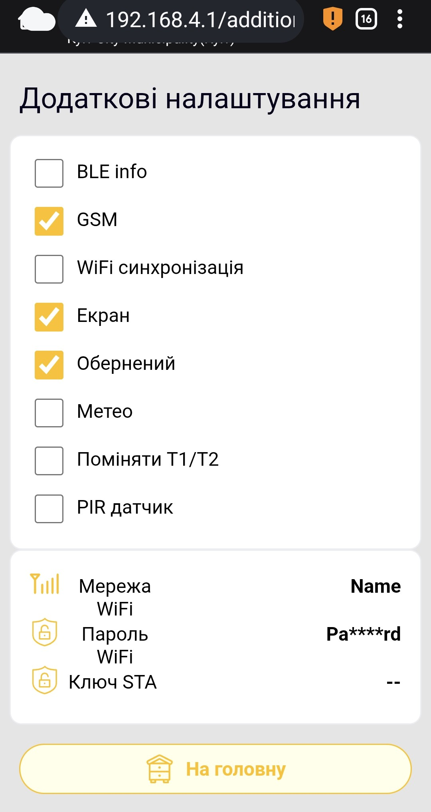

# Ek Cihaz Ayarları

 **Ek Ayarlar** sayfa web arayüzüne aittir. BeeApiary arı kovanı tartı terazileri. Hangi ek donanımın kurulu olduğunu belirtir ve bireysel veri iletim kanallarını kontrol eder.

## Nasıl Açılır

1. [Cihaz erişim noktasına bağlanın](../guides/configure-local-wifi.md).
2. Açık `http://192.168.4.1`.
3. Ana sayfada şunu seçin: **Ek Ayarlar**.
4. Web arayüzü uyarısını okuyun. Yalnızca ayarları kasıtlı olarak kontrol etmek veya değiştirmek için ilerleyin.

!!! warning "Ayarları Rastgele Değiştirmeyin"
    Yanlış bir değer cihazın çalışmasını bozabilir. Donanım bayraklarını yalnızca ilgili donanım fiziksel olarak kurulduğunda etkinleştirin. Ağ ayarlarını veya anahtarlarını gereksiz yere değiştirmeyin.

{ .doc-screenshot }

Ekran görüntüsündeki ağ değerleri yalnızca örnektir. Cihazınızda farklı olacaktır.

## Anahtarlar

| Öğe | İşlev | Notlar |
|---|---|---|
| **BLE info** | Bluetooth aracılığıyla yerel veri senkronizasyonunu etkinleştirir. | Etkinleştirdikten sonra yapılandırın [Uygulamada Bluetooth senkronizasyonu](../guides/configure-bluetooth-sync.md). |
| **GSM** | GSM modülünü ve SMS yoluyla veri aktarımını sağlar. | GSM iletişimi kullanılmıyorsa, örneğin veri iletimi olmadan kış aylarında depolama sırasında bunu devre dışı bırakın. |
| **Wi-Fi senkronizasyonu** | Harici bir Wi-Fi ağı üzerinden otomatik veri aktarımını etkinleştirir. | Uygulama, hazırlanan Wi-Fi ve bulut ayarlarını cihaza aktardığında genellikle otomatik olarak etkinleştirilir. Doğru ağ alanları olmadan manuel olarak etkinleştirmeyin. |
| **Ekran** | Cihaza fiziksel olarak bir OLED ekranın takıldığını söyler ve çalışmasını sağlar. | Yalnızca bir ekran takılıysa etkinleştirin. |
| **Ters çevrilmiş** | OLED ekran görüntüsünü 180° döndürür. | Yalnızca şu durumlarda alakalı **Ekran** etkinleştirildi. |
| **Hava Durumu** | Basınç, nem ve ilave sıcaklık için kurulu hava durumu sensörünü etkinleştirir. | Yalnızca sensör takılıysa etkinleştirin. |
| **T1/T2'yi değiştir** | Ana T1 ve T2 termometrelerinin iletilen değerlerini değiştirir. | Dahili ve harici sensörler fiziksel olarak değiştirilmişse kullanışlıdır. Uygulamadaki kanal adlarını ve ayarları değiştirmeden bırakın. |
| **PIR sensörü** | PIR veya başka bir uyumlu sistem uyandırma sensörü için alarm girişini etkinleştirir. | Yalnızca bir sensör bağlıysa etkinleştirin. |

## Ağ Alanları

| Alan | İşlev | Notlar |
|---|---|---|
| **Wi-Fi ağı** | Cihazın bağlanacağı harici Wi-Fi ağının adı. | Cihazın yakınında bulunan ağın SSID'siyle tam olarak eşleşmelidir. |
| **Wi-Fi şifresi** | Harici Wi-Fi ağının şifresi. | Web arayüzü değeri maskeler. |
| **STA anahtarı** | Uygulama aracılığıyla kayıt sırasında alınan hizmet iletim anahtarı. | Manuel olarak düzenleme yapmayın. |

Wi-Fi parametrelerini ayarlamak daha güvenlidir. [uygulamadaki senkronizasyon ayarları](../guides/configure-wifi-sync.md). Uygulama, gerekli verileri oluşturur ve doğrudan bağlantı sırasında bunları cihaza aktarır. `apiary_net`.
