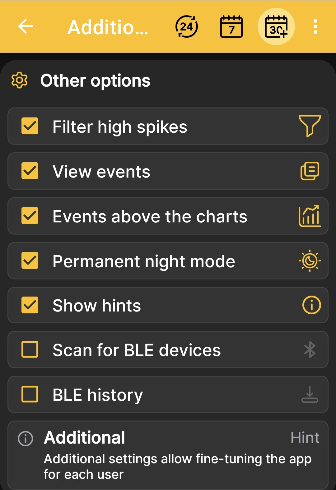
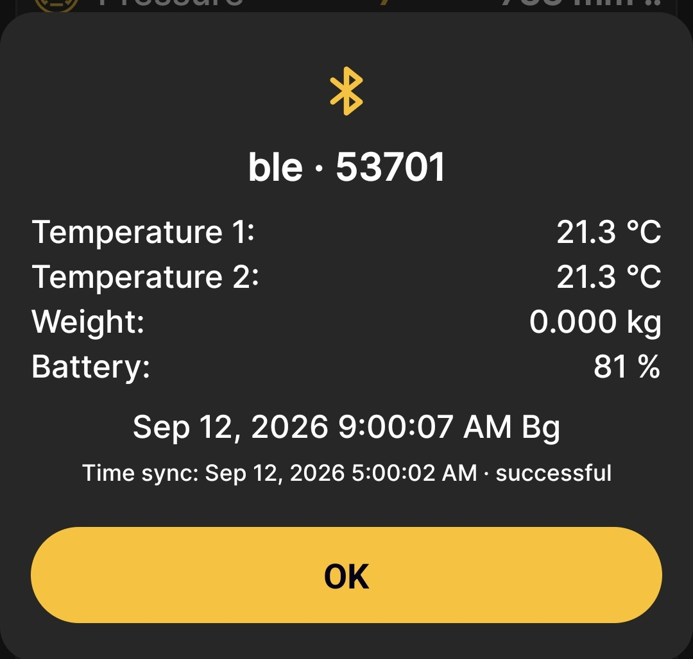

# Bluetooth Senkronizasyonu Nasıl Kurulur

!!! danger "Cihaz uyumluluğu"
    Bu özellik yalnızca Ağustos 2026'dan sonra üretilen cihazlar tarafından desteklenir. Daha önce üretilen cihazlar da bu işlevi kazanabilir ancak bunların fabrikada güncellenmesi gerekir. Şu anda kendi başınıza yükleyebileceğiniz basit bir yama yok.

Bu prosedür, otomatik veri alımını ayarlar. BeeApiary telefon yakındayken arı kovanı tartı terazisi. Senkronizasyon SIM kart veya İnternet erişimi gerektirmez.

## Başlamadan önce

1. Tartım terazilerinin yukarıdaki uyumluluk gereksinimlerini karşıladığından emin olun.
2. [Tartım terazisinin saatini senkronize edin](../system/time-synchronization.md) telefonla. Fark iki dakikayı geçmemelidir.
3. Telefonda Bluetooth'u açın.
4. Uygulamaya, Bluetooth izinleri de dahil olmak üzere istenen tüm izinleri verin.
5. Uygulamanın arka planda çalışmasına ve gereken saatte uyanmasına izin verin. Mevcut durumu gözden geçirin [uygulama yükleme önerileri](../app/installation.md).

!!! warning "Kurulumdan önce zamanı kontrol edin"
    Fark iki dakikayı aşarsa, tartı terazileri telefon dinlemeye başlamadan önce veya sonra kullanılabilir duruma gelebilir ve bu durum otomatik senkronizasyonu engelleyebilir.

## Tartım terazilerinde BLE bilgisini etkinleştirin

1. [Tartım terazisinin erişim noktasına bağlanın](configure-local-wifi.md).
2. Açık `http://192.168.4.1` ve seç **Ek ayarlar**.
3. Seç **BLE info** ve değişiklikleri kaydedin.

Bu seçenek ve diğer anahtarlar aşağıda açıklanmıştır. [Ek Cihaz Ayarları](../device/additional-settings.md).

## Uygulamada senkronizasyonu etkinleştirin

4. Uygulamanın ana menüsünü açın, şuraya gidin: **Ayarlar**ve açık **Ek ayarlar**.
5. Etkinleştir **BLE cihazlarını tarayın** Böylece uygulama yakındaki tartıları bulabilir ve ölçüm alabilir.
6. Etkinleştir **BLE geçmişi** Böylece uygulama aynı zamanda önceki güne ait veriler de dahil olmak üzere depolanan geçmişi de alır.

    { .doc-screenshot }

    !!! warning "Gerekli seçenekleri etkinleştirin"
        Ekran görüntüsü genel bir örnek olduğundan her iki Bluetooth anahtarı da devre dışı olarak gösterilir. **BLE cihazlarını tarayın** senkronizasyon için etkinleştirilmelidir. Etkinleştirme **BLE geçmişi** Uygulamanın mevcut geçmişi alabilmesi ve kaçırılan ölçümleri geri yükleyebilmesi için de önerilir.

    Bu ekranın tam açıklaması için bkz. [Ek Uygulama Ayarları](../app/additional-settings.md).

7. Uygulamanın ana ekranına dönün. Bir sonraki saatlik döngü boyunca Bluetooth'u etkin ve telefonu güvenilir Bluetooth aralığında tutun.

## Sonucu kontrol edin

Senkronizasyon yalnızca şu durumlarda gerçekleşir: **BLE info** Tartım terazilerinde ve Bluetooth'ta etkinleştirilir ve ilgili uygulama seçenekleri telefonda etkinleştirilir. Tartım terazileri, programlanmış bir uyandırma sırasında veya sonrasında iletişim için kullanılabilir hale gelir [manyetik anahtarla etkinleştirme](../device/installation.md#activation-reset).

Uygulama, açıkken veya Android'in gerekli zamanda çalışmasına ve uyanmasına izin vermesi durumunda arka planda veri alışverişi yapabilir.

8. Verinin alındığını onaylayan mesajı bekleyin.

    { .doc-screenshot }

    Bu pencere şunları gösterir:

    - arı kovanı adı ve tartı terazisi numarası;
    - tartı terazisinin konfigürasyonu için mevcut en yeni ölçüm seti;
    - alınan ölçümün tarihi ve saati;
    - saat eşitlemesinin zamanı ve sonucu.

    Henüz kaydedilmemiş tartım terazilerine bağlanırken, **Cihaz ekle** düğmesi de görünebilir. Standardı tamamlamak için kullanın [ekleme prosedürü BeeApiary arı kovanı tartı terazileri](../app/add-device.md) bir kez. Uygulama daha sonra bunları otomatik olarak tanıyacaktır.

9. Dokunun **tamam**. Gerekirse en son mesajı aracılığıyla tekrar açın. **BLE Info** ana menüde.
10. Yeni değerlerin uygulamanın ana ekranında ve grafiklerinde göründüğünden emin olun.

Bitti: Telefon yakındayken uygulama otomatik olarak mevcut verileri alacaktır. Bağlantı birkaç saat boyunca kullanılamıyorsa etkinleştirilir **BLE geçmişi** Bir günden bir haftaya kadar mevcut geçmiş derinliği dahilinde, bir sonraki başarılı senkronizasyon sırasında kaçırılan ölçümleri geri yükleyebilir.

Nasıl çalıştığı hakkında daha fazla bilgi için bkz. [Bluetooth Veri Senkronizasyonu](../system/bluetooth.md).
