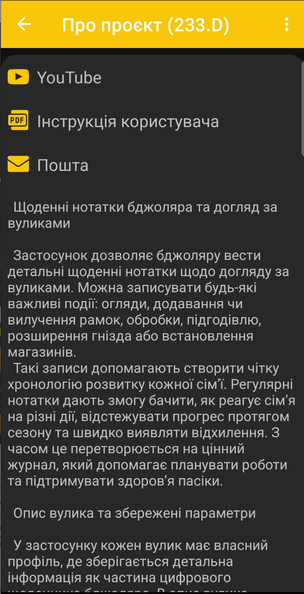
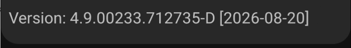

# Про застосунок

Сторінка **Про застосунок** містить короткий опис BeeApiary, корисні посилання та відомості про встановлену версію.

{ .doc-screenshot }

На сторінці доступні:

- **YouTube** — відеоінструкції з налаштування та використання;
- **Інструкція користувача** — текстова документація BeeApiary;
- **Пошта** — зв'язок із підтримкою електронною поштою;
- короткий опис можливостей застосунку та ведення журналу пасіки.

## Версія застосунку

У нижній частині сторінки вказані ідентифікатор установленої версії та дата складання.

{ .doc-screenshot }

Ці відомості допомагають перевірити актуальність застосунку й точно назвати версію під час звернення до підтримки.
