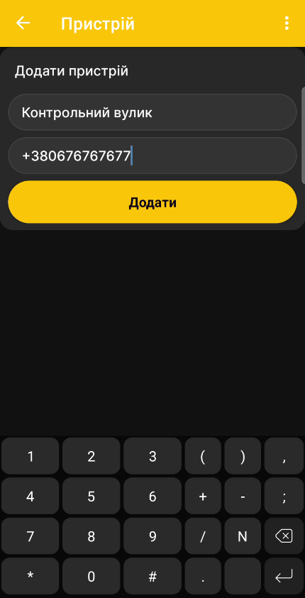

# Додати пасічні ваги BeeApiary

Додайте пасічні ваги BeeApiary до застосунку, щоб отримувати й переглядати автоматичні вимірювання ваги, температури та інших доступних показників.

## Додавання пристрою для GSM

!!! note "Розділ у процесі розширення"
    Інструкцію буде доповнено новими зображеннями додавання пристрою та введення номера встановленої SIM-картки. Наведена нижче послідовність дій залишається актуальною.

Для отримання даних через GSM укажіть номер SIM-картки, установленої у пасічних вагах BeeApiary. Для інших способів дивіться [Отримання даних у застосунку](../system/connectivity.md).

1. У застосунку BeeApiary відкрийте список пристроїв і натисніть **Додати пристрій**.

    { .doc-screenshot }

2. Укажіть назву вулика або пасіки та номер SIM-картки пасічних ваг BeeApiary.

    { .doc-screenshot }

    { .doc-screenshot }

3. Натисніть **Додати** й перевірте, що пристрій з'явився у списку.

    { .doc-screenshot }

4. Дочекайтеся першого SMS із вимірюваннями.

    { .doc-screenshot }

Після отримання даних пристрій буде доступний на [головному екрані застосунку](main-screen.md). Дані також можуть надходити через пряме Wi-Fi-з'єднання, Wi-Fi мережу пасіки або Bluetooth.
