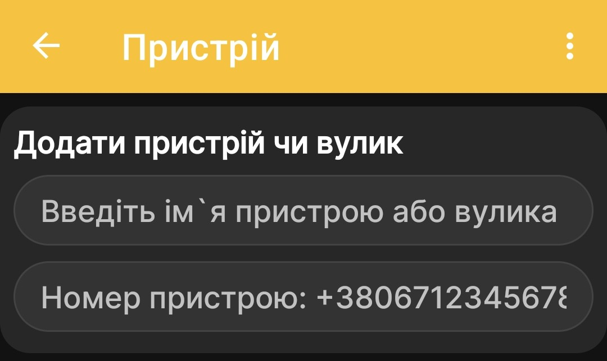
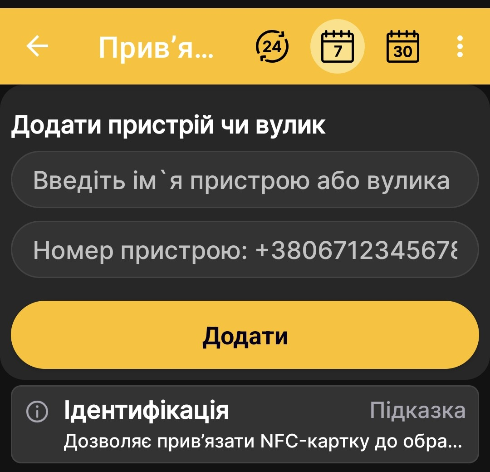

# Додати пасічні ваги BeeApiary

Додайте пасічні ваги BeeApiary, щоб пов'язати профіль вулика з фізичним обладнанням і отримувати автоматичні вимірювання. Доступні канали передавання та їхні умови описані на сторінці [Отримання даних у застосунку](../system/connectivity.md).

## Додавання ваг

1. Відкрийте **Головне меню → Додати пристрій чи вулик**.
2. На екрані **Пристрої та вулики** натисніть **Додати пристрій**.
3. Уведіть зрозумілу назву вулика або пасічних ваг.
4. Якщо плануєте отримувати дані через GSM, уведіть номер SIM-картки, установленої у пасічних вагах.

    { .doc-screenshot }

5. Натисніть **Додати**.

Після збереження профіль з'явиться у списку пристроїв і вуликів. Дані від фізичних ваг почнуть відображатися після налаштування та першого успішного обміну через один із [підтримуваних каналів](../system/connectivity.md).

## Додавання через NFC-картку

Пасічні ваги можна додати під час розпізнавання NFC-картки. У цьому випадку застосунок одночасно створить профіль і прив'яже до нього картку.

1. Піднесіть NFC-картку до телефона.
2. У запиті про використання картки як ідентифікатора вулика виберіть потрібну дію:
   - **Прив'язати до існуючого** — вибрати вже створений профіль;
   - **Додати новий** — створити новий профіль із цією NFC-прив'язкою.

    { .doc-screenshot }

3. Після вибору **Додати новий** уведіть назву та, для GSM, номер SIM-картки пасічних ваг.
4. Натисніть **Додати**.

    { .doc-screenshot }

Докладніше про ідентифікацію вуликів і доступні дії дивіться на сторінці [NFC-мітки та дії](nfc-settings.md).
