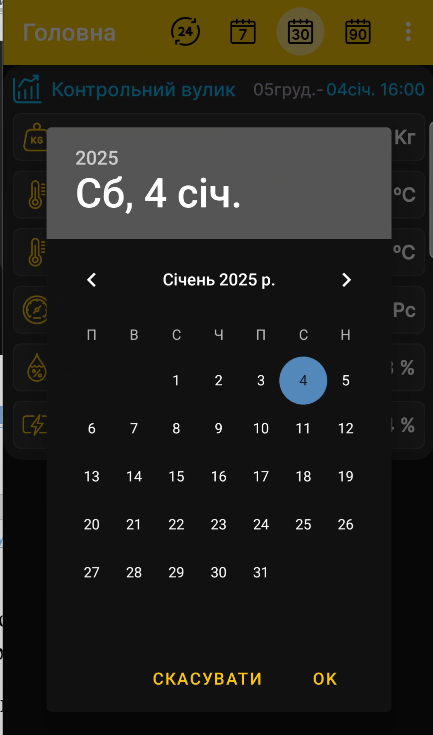

# Період перегляду графіків

Коротко натисніть заголовок вибраного вулика на головному екрані, щоб перейти до графіків.

## Тривалість періоду

Піктограми доби, тижня та місяця визначають одиницю періоду. Натискайте відповідну піктограму кілька разів, щоб послідовно вибрати 1, 2, 3 й більше діб, тижнів або місяців.

## Кінцева дата

Натисніть дату й час у верхній частині блока вибраного вулика та виберіть потрібну дату в календарі. Вибраний проміжок завершуватиметься цією датою, що дає змогу переглядати дані вулика за минулий час.

{ .doc-screenshot }

Після вибору застосунок перебудує [графіки](charts.md) для заданого проміжку.
