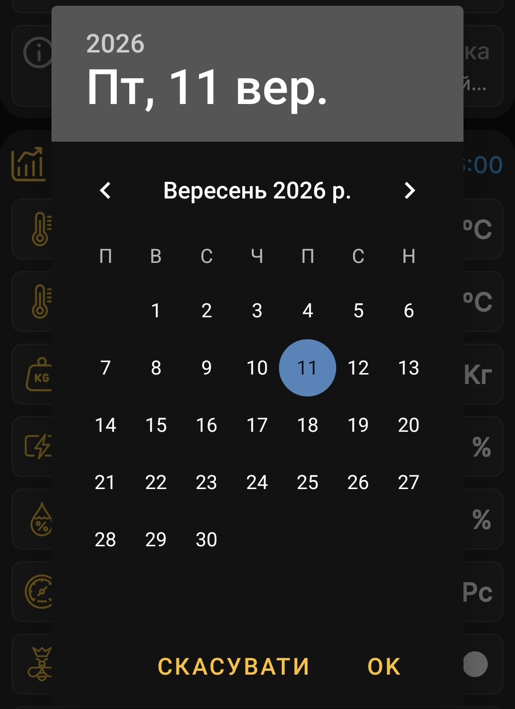

# Період перегляду графіків

Коротко натисніть заголовок вибраного вулика на головному екрані, щоб перейти до графіків.

## Тривалість періоду

Піктограми доби, тижня та місяця визначають одиницю періоду. Натискайте відповідну піктограму кілька разів, щоб послідовно вибрати 1, 2, 3 й більше діб, тижнів або місяців.

## Кінцева дата

Натисніть дату й час у верхній частині блока вибраного вулика та виберіть потрібну дату в календарі. Ця дата є кінцем проміжку, а його початок застосунок визначає за вибраною тривалістю.

Наприклад, якщо вибрати кінцеву дату **4 вересня** та період **один місяць**, графіки покажуть дані від **4 серпня до 4 вересня**.

{ .doc-screenshot }

Кінцевою можна зробити будь-яку доступну дату, зокрема дату рік тому. Це дає змогу переглядати давні вимірювання й події за умови, що відповідні дані збережені в застосунку.

Після вибору застосунок перебудує [графіки](charts.md) для заданого проміжку.
