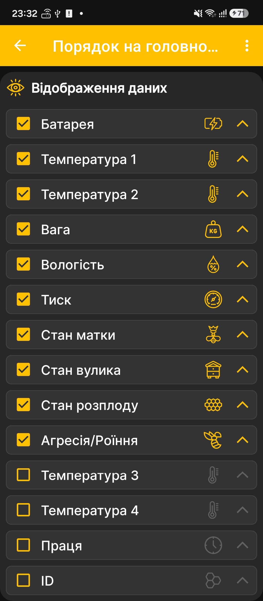

# Вибір даних і графіків

Екран **Порядок на головному екрані** одночасно визначає наявність і порядок плиток на головному екрані та наявність і порядок графіків на екрані графіків. Графіки утворюються лише для числових показників, які змінюються з часом.

1. Відкрийте **Головне меню → Налаштування → Порядок на головному екрані**.
2. Установіть прапорці біля даних, які потрібно показувати.
3. Зніміть прапорці з непотрібних плиток.
4. За допомогою стрілок праворуч перемістіть найважливіші показники вище.

{ .doc-screenshot }

Після повернення на [головний екран](main-screen.md) застосунок використовуватиме вибраний набір і порядок плиток. На екрані [графіків](charts.md) ті самі налаштування визначатимуть наявність і порядок графіків для вибраних числових показників.

Докладні поля стану вулика налаштовуються [на окремому екрані](hive-state-settings.md). Показ подій та їхнє розташування відносно графіків задаються в [додаткових налаштуваннях застосунку](additional-settings.md).
