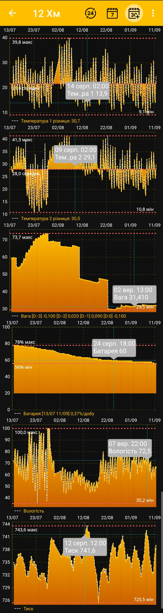

# Графіки

Графіки будуються для числових показників, значення яких змінюються з часом: ваги, температури, вологості, тиску та заряду батареї. Текстові описи стану вулика залишаються окремими блоками [головного екрана](main-screen.md), а [події](events-and-notes.md) можна відображати як часові мітки поверх графіків.

Після вибору періоду й кінцевої дати застосунок перебудовує активні графіки для заданого проміжку:

{ .doc-screenshot }

## Інтерактивний перегляд

- Натисніть точку графіка, щоб побачити у спливній підказці її точний час і значення.
- Масштабуйте або розтягуйте графіки жестами, щоб докладніше переглянути потрібну частину періоду.
- Позначки мінімального й максимального значень допомагають швидко оцінити діапазон показника.
- Для температури також показується середнє значення за період.
- На графіках вологості й атмосферного тиску можуть відображатися рекомендовані значення.
- Графік батареї показує рівень критичного розряду та зміну заряду за добу.

Події, створені для вибраного вулика, можуть відображатися одночасно з вимірюваннями відповідно до своїх часових міток. Це допомагає зіставити роботи на пасіці зі змінами ваги, температури та інших показників. Видимість подій і порядок шарів налаштовуються на сторінці [Додаткові налаштування застосунку](additional-settings.md).

Набір і порядок графіків залежать від вибраних плиток і налаштувань відображення:

- [Вибрати період і кінцеву дату](chart-period.md)
- [Вибрати дані, графіки та їх порядок](chart-settings.md)

Набір допоміжних показників і зручність перегляду можуть розширюватися в нових версіях застосунку.
