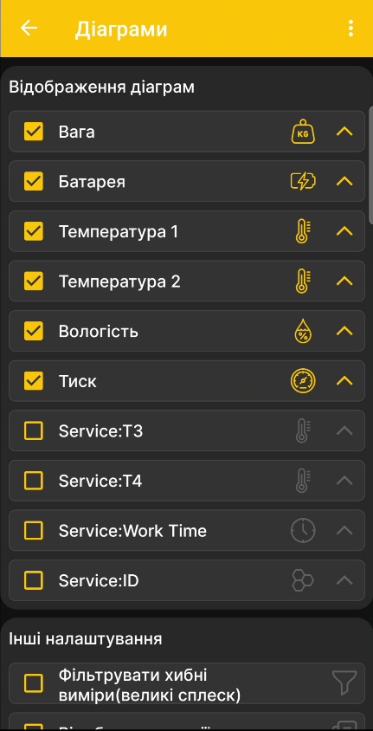
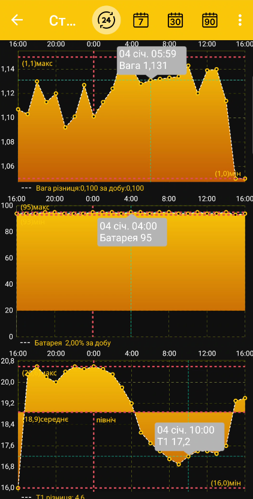

# Графіки

## Вибір графіків

1. Відкрийте **Головне меню → Налаштування → Діаграми**.
2. Увімкніть потрібні типи вимірювань: температуру, вагу, батарею тощо.
3. Змініть порядок за допомогою стрілок праворуч від типів вимірювань.
4. За потреби ввімкніть фільтрацію випадкових хибних значень.

{ .doc-screenshot }

## Період

Коротко натисніть заголовок вулика, щоб перейти до графіків. Натисніть кінцеву дату або період і виберіть добу, тиждень, місяць, 90 діб чи інший доступний проміжок.

{ .doc-screenshot }

Після вибору застосунок перебудовує графіки для заданого проміжку:

{ .doc-screenshot }
