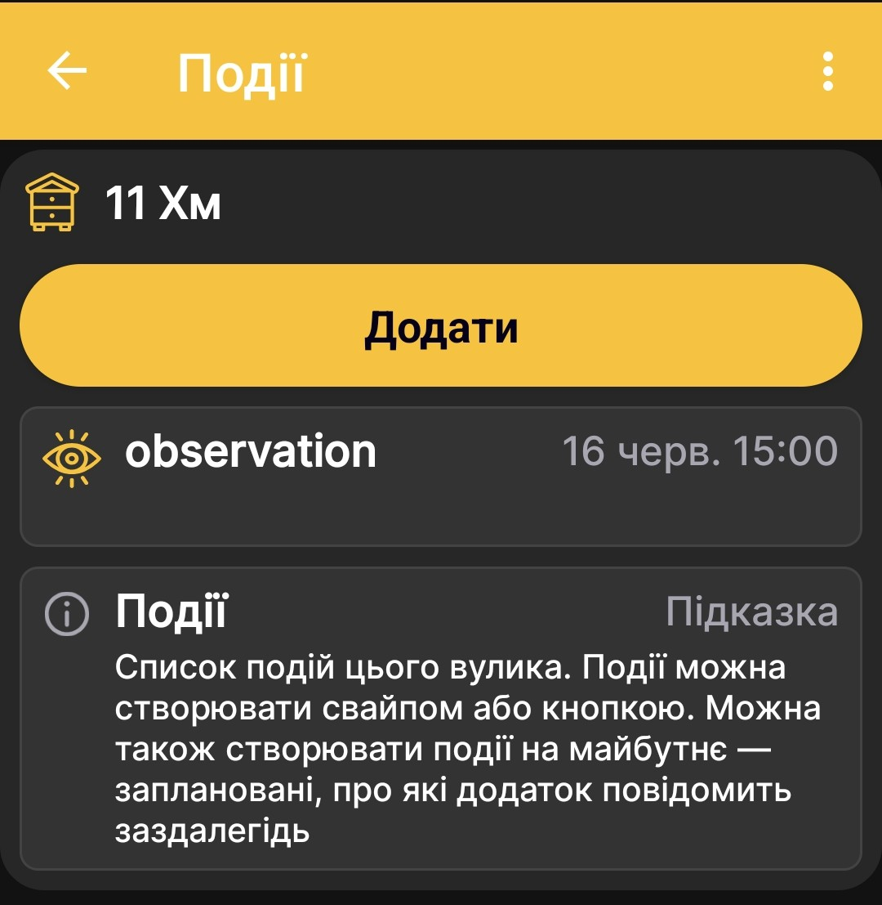
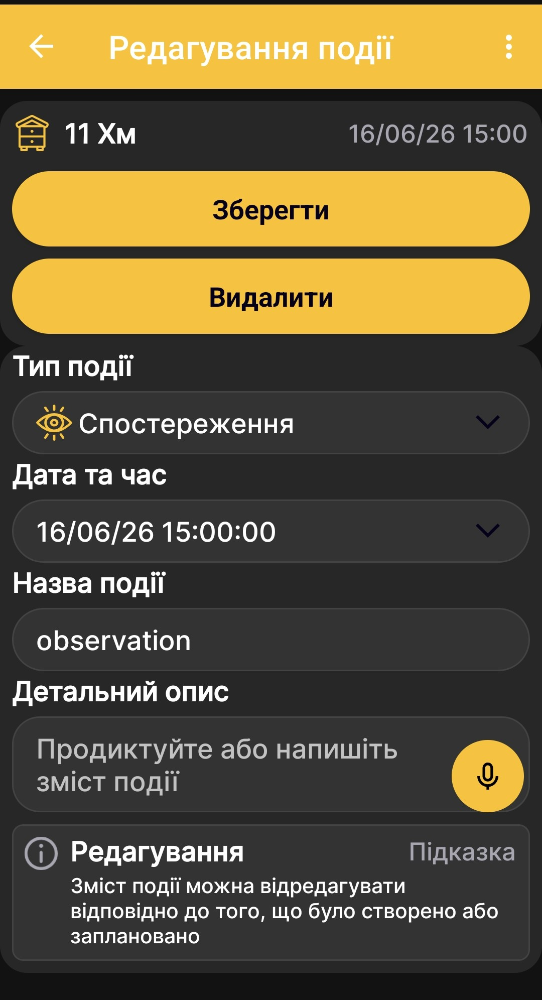
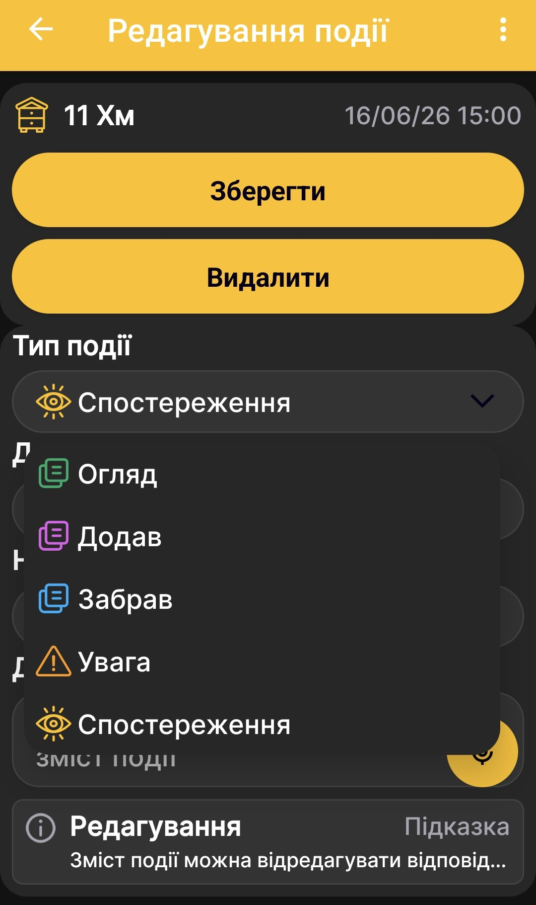

# Події та нотатки

Події допомагають вести хронологію робіт, оглядів і спостережень для кожного вулика. Щоб перейти до списку подій з [головного екрана застосунку](main-screen.md), проведіть пальцем праворуч.

## Список подій

На екрані показано вибраний вулик і збережені для нього події. Кожен запис містить піктограму типу, назву, колірне позначення та дату й час. Натисніть **Додати**, щоб створити подію, або виберіть наявний запис для редагування.

{ .doc-screenshot }

Можна також створювати майбутні заплановані події. Застосунок повідомляє про них заздалегідь, щоб запланована робота не загубилася серед поточних записів.

## Додавання або редагування події

{ .doc-screenshot }

| Елемент | Призначення |
|---|---|
| **Тип події** | Визначає призначення, піктограму й колірне позначення запису. |
| **Дата та час** | Фіксує момент події або час запланованої роботи. |
| **Назва події** | Коротко називає виконану чи заплановану дію. |
| **Детальний опис** | Зберігає додаткові відомості, результати огляду або нотатку. |
| **Зберегти** | Зберігає нову подію або внесені зміни. |
| **Видалити** | Видаляє відкриту подію. |

!!! note "Голосове введення"
    Поле, позначене піктограмою мікрофона, підтримує диктування. Застосунок перетворює мовлення на текст, який можна надалі редагувати, шукати та копіювати. Аудіозапис при цьому не створюється.

## Типи подій

{ .doc-screenshot }

| Тип | Для чого його використовувати |
|---|---|
| **Огляд** | Для запису результатів огляду вулика. |
| **Додав** | Для позначення того, що до вулика щось додано. |
| **Забрав** | Для позначення того, що з вулика щось забрано. |
| **Увага** | Для подій, які потребують окремої уваги. |
| **Спостереження** | Для фіксації поміченого стану або явища. |

Типи подій розрізняються кольорами та піктограмами. На [графіках](charts.md) події відображаються з часовими мітками й розташовуються відповідно до моменту, коли вони сталися. Це допомагає зіставити роботи на пасіці зі змінами ваги, температури та інших вимірювань.
