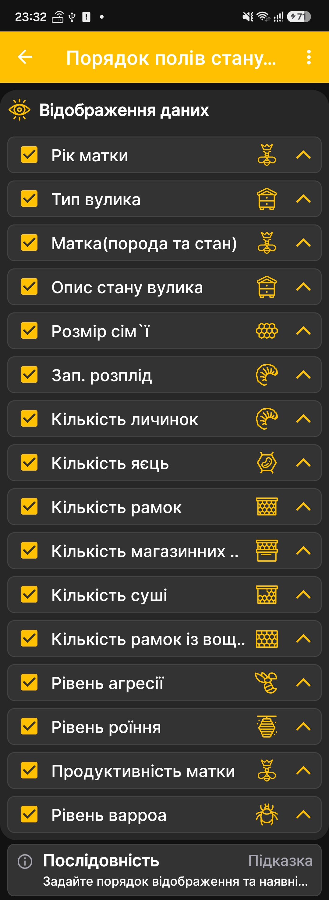

# Порядок полів стану вулика

Цей екран керує видимістю та порядком полів у розгорнутому [стані вулика](hive-state.md).

1. Відкрийте **Головне меню → Налаштування → Порядок полів стану вулика**.
2. Залиште прапорці біля відомостей, які потрібно показувати.
3. Вимкніть поля, які не використовуються у вашому господарстві.
4. За допомогою стрілок праворуч перемістіть важливіші поля вище.

{ .doc-screenshot }

Можна налаштувати відображення року й стану матки, типу та опису вулика, сили сім'ї, розплоду, личинок, яєць, різних типів рамок, агресивності, роїння, продуктивності матки та рівня варроа.

Зміна порядку впливає на подання даних у застосунку, але не змінює самі збережені записи про вулик.
