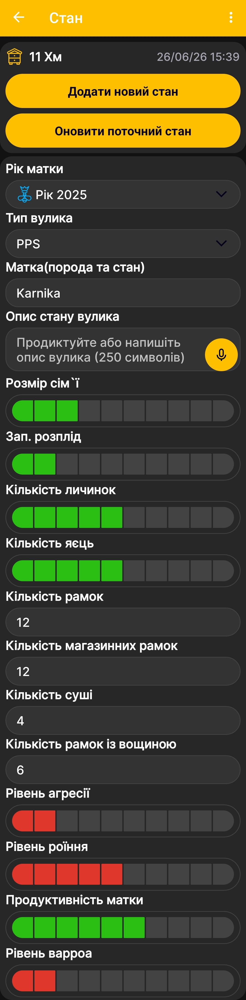

# Стан вулика

Стан вулика дає змогу зберігати результати оглядів: відомості про матку, силу сім'ї, розплід, рамки та інші важливі показники. Щоб перейти до цього екрана з [головного екрана застосунку](main-screen.md), проведіть пальцем ліворуч.

{ .doc-screenshot }

## Додавання й оновлення стану

У верхній частині екрана показано вибраний вулик, а також дату й час запису.

- **Додати новий стан** — створює окремий запис стану для вибраної дати й часу.
- **Оновити поточний стан** — зберігає зміни в поточному записі без створення ще одного стану.

## Поля стану вулика

| Поле | Що в ньому зазначають |
|---|---|
| **Рік матки** | Рік виведення або підсаджування матки. |
| **Тип вулика** | Конструкцію вулика з налаштованого списку [типів вуликів](hive-types.md). |
| **Матка (порода, стан)** | Породу матки та коротку оцінку її поточного стану. |
| **Опис стану вулика** | Довільний текстовий опис результатів огляду. |
| **Розмір сім'ї** | Відносну оцінку сили бджолиної сім'ї за шкалою. |
| **Зап. розплід** | Відносну оцінку кількості запечатаного розплоду. |
| **Кількість личинок** | Відносну оцінку кількості личинок. |
| **Кількість яєць** | Відносну оцінку кількості яєць. |
| **Кількість рамок** | Загальну кількість рамок у вулику. |
| **Кількість магазинних рамок** | Кількість установлених магазинних рамок. |
| **Кількість суші** | Кількість рамок із відбудованими стільниками. |
| **Кількість рамок із вощиною** | Кількість рамок, у яких установлено вощину. |
| **Рівень агресії** | Відносну оцінку агресивності сім'ї. |
| **Рівень роїння** | Відносну оцінку ройового стану сім'ї. |
| **Продуктивність матки** | Відносну оцінку роботи матки. |
| **Рівень вароа** | Відносну оцінку ураження кліщем вароа. |

Поля зі шкалою призначені для відносної оцінки, а поля рамок — для введення кількості. Заповнюйте лише ті відомості, які потрібні для вашого способу ведення пасіки.

!!! note "Голосове введення"
    Поле з піктограмою мікрофона можна не набирати вручну. Продиктуйте опис, і застосунок перетворить мовлення на текст. Це текстовий запис, який надалі можна редагувати, шукати й копіювати, а не збережений аудіофайл.

Наявність полів на екрані та їхню послідовність визначає меню [«Порядок полів стану вулика»](hive-state-settings.md).
