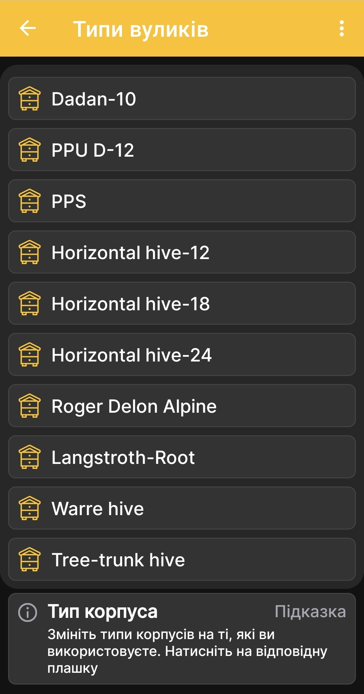

# Типи вуликів

Екран **Типи вуликів** дає змогу узгодити перелік типів корпусів із тими, які використовуються у вашому господарстві. Застосунок містить кілька зразкових типів, але цей початковий перелік не претендує на повне охоплення всіх конструкцій вуликів.

Зазвичай у господарстві використовують від одного до п'яти типів корпусів, тому початковий перелік сформовано із запасом для звичайного використання. Користувач може вільно змінювати наявні типи або розширювати список відповідно до своєї пасіки.

1. Відкрийте **Головне меню → Налаштування → Типи вуликів**.
2. Знайдіть потрібний тип у списку.
3. Натисніть відповідну плашку, щоб налаштувати його використання в застосунку.

{ .doc-screenshot }

Це налаштування належить описам вуликів у застосунку й не змінює апаратну конфігурацію пасічних ваг BeeApiary.
