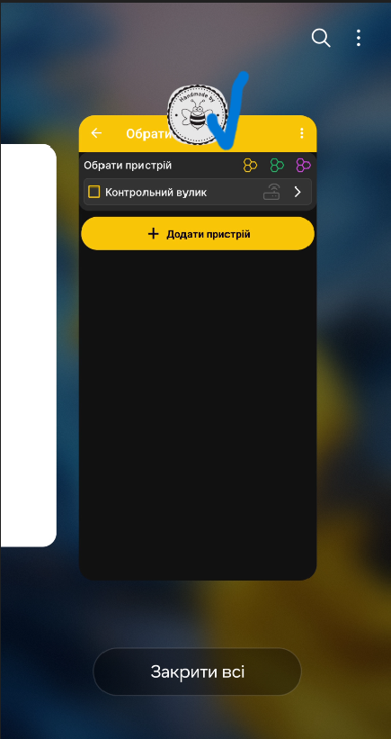
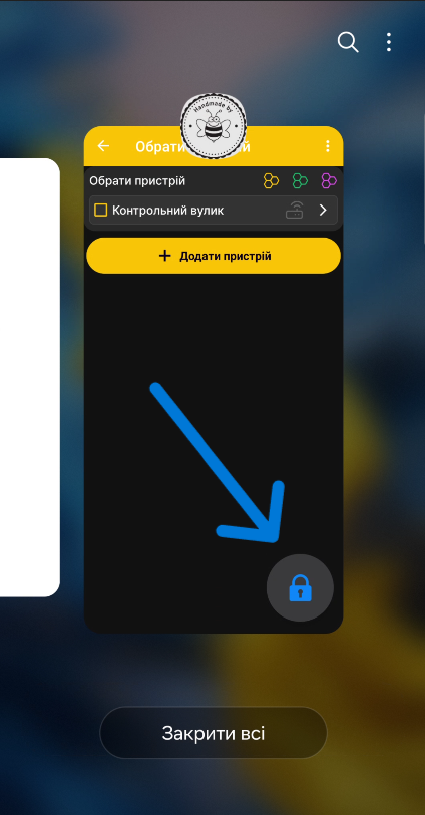
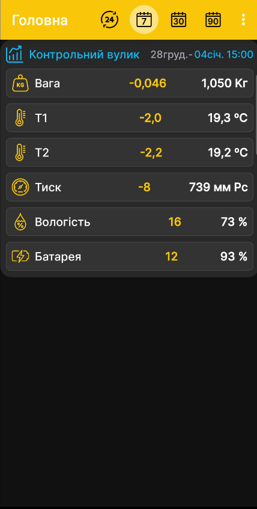

# Встановлення застосунку BeeApiary

## Встановлення

!!! note "Дозволи застосунку"
    Під час першого запуску рекомендуємо надати **всі дозволи**, які запитує застосунок. Якщо відхилити частину з них, деякі функції можуть не працювати або працювати неправильно; поведінку для всіх можливих комбінацій обмежень не перевірено. Щоб не ускладнювати налаштування та пошук причин проблем, надайте всі запитані дозволи.

!!! warning "Для GSM дозвіл на SMS обов'язковий"
    Без дозволу на обробку SMS отримання даних через GSM у застосунку не працюватиме взагалі: застосунок не зможе прочитати повідомлення від пристрою, тому вимірювання не з'являться.

1. Відкрийте [сторінку застосунку в Google Play](https://play.google.com/store/apps/details?id=com.beeapiary).
2. Установіть і запустіть застосунок.
3. Надайте всі дозволи, які запитує застосунок.
4. Якщо плануєте отримувати дані через GSM, обов'язково надайте дозвіл на обробку SMS — без нього застосунок не зможе приймати та обробляти SMS пристрою.

    { .doc-screenshot }

5. Відкрийте перелік запущених застосунків і натисніть іконку BeeApiary.

    { .doc-screenshot }

6. Виберіть **Не закривати** та перевірте, що на картці застосунку з'явився замок.

    { .doc-screenshot }

    { .doc-screenshot }

## Додавання пристрою для GSM

Для отримання даних через GSM додайте пристрій і вкажіть номер установленої в ньому SIM-картки. Для інших способів дивіться [Отримання даних у застосунку](../system/connectivity.md).

1. У BeeApiary відкрийте список пристроїв і натисніть **Додати пристрій**.

    { .doc-screenshot }

2. Укажіть назву вулика або пасіки та номер SIM-картки вимірювального пристрою BeeApiary.

    { .doc-screenshot }

    { .doc-screenshot }

3. Натисніть **Додати** й перевірте, що пристрій з'явився у списку.

    { .doc-screenshot }

4. Дочекайтеся першого SMS.

    { .doc-screenshot }

Після встановлення застосунок також може отримувати дані через пряме Wi-Fi-з'єднання з пристроєм, Wi-Fi мережу пасіки або Bluetooth.

Попередні APK у [репозиторії Android_Apk](https://github.com/Ivan-Bdgilko/Android_Apk) застарілі. Для актуального встановлення використовуйте Google Play.
