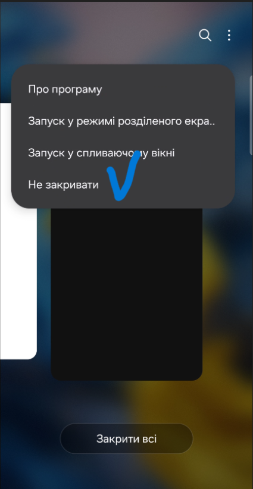

# Встановлення застосунку BeeApiary

## Вимоги

У посібнику користувача зазначено Android 12 або новішу версію.

## Встановлення

1. Відкрийте [сторінку застосунку в Google Play](https://play.google.com/store/apps/details?id=com.beeapiary).
2. Установіть і запустіть застосунок.
3. Надайте дозвіл на обробку SMS — без нього застосунок не зможе приймати дані пристрою.

    { .doc-screenshot }

4. Відкрийте перелік запущених застосунків і натисніть іконку BeeApiary.

    { .doc-screenshot }

5. Виберіть **Не закривати** та перевірте, що на картці застосунку з'явився замок.

    { .doc-screenshot }

    { .doc-screenshot }

6. У BeeApiary відкрийте список пристроїв і натисніть **Додати пристрій**.

    { .doc-screenshot }

7. Укажіть назву вулика або пасіки та номер SIM-картки вимірювального пристрою BeeApiary.

    { .doc-screenshot }

    { .doc-screenshot }

8. Натисніть **Додати** й перевірте, що пристрій з'явився у списку.

    { .doc-screenshot }

9. Дочекайтеся першого SMS або [завантажте архів](../guides/download-archive.md), якщо GSM не використовується.

    { .doc-screenshot }

Попередні APK з [репозиторію Android_Apk](https://github.com/Ivan-Bdgilko/Android_Apk) є застарілим джерелом; для актуального встановлення використовуйте Google Play.
