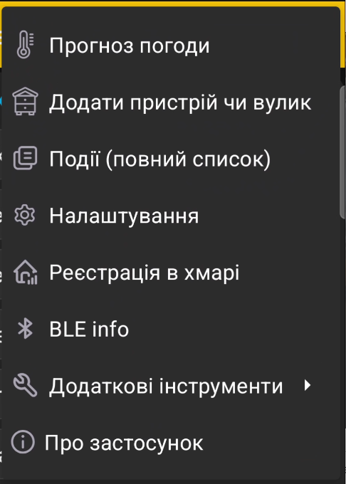

# Головне меню

Відкрийте меню у правому верхньому куті головного екрана, щоб перейти до загальних функцій застосунку.

{ .doc-screenshot }

| Пункт меню | Призначення |
|---|---|
| **Прогноз погоди** | Показує прогноз погоди для роботи на пасіці. |
| **Додати пристрій чи вулик** | Відкриває додавання [пасічних ваг BeeApiary](add-device.md) або окремого [профілю вулика](add-hive.md). |
| **Події (повний список)** | Відкриває [події та нотатки](events-and-notes.md) для всіх вуликів. |
| **Налаштування** | Відкриває загальні [налаштування застосунку](settings/index.md). |
| **Реєстрація в хмарі** | Готує пристрій до [синхронізації через Wi-Fi мережу пасіки](../guides/configure-wifi-sync.md). |
| **BLE info** | Відкриває відомості про [синхронізацію через Bluetooth](../system/bluetooth.md). |
| **Додаткові інструменти** | Відкриває [резервне копіювання, відновлення та збереження службового журналу](additional-tools.md). |
| **Про застосунок** | Показує [опис, корисні посилання та встановлену версію](about.md). |
