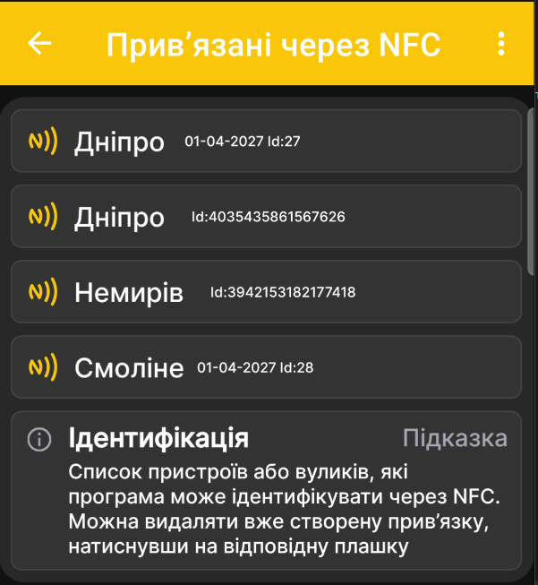
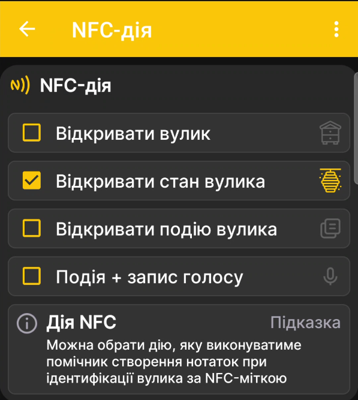

# NFC-мітки та дії

Налаштування NFC складаються з двох пов'язаних екранів: списку прив'язаних міток і вибору дії, яку застосунок виконає після розпізнавання вулика.

## Що таке NFC-мітка

NFC-мітка — це невеликий електронний ідентифікатор. Вона може мати вигляд брелока, монетки, наклейки, звичайної NFC-картки або спеціальної картки для вулика. Мітку можна закріпити на вулику в зручному для зчитування місці, наприклад під дахом або на стінці.

Після піднесення телефона з NFC застосунок швидко визначає конкретний вулик і виконує вибрану дію: відкриває його відомості, стан або події чи одразу переходить до створення події з голосовим введенням.

Достатньо один раз прив'язати сумісну мітку до профілю вулика та залишити її на ньому. Надалі це скорочує час пошуку потрібного профілю й допомагає вести повнішу історію без окремих паперових нотаток.

!!! info "Голосова нотатка перетворюється на текст"
    Застосунок не просто зберігає запис голосу: продиктована нотатка перетворюється на текст. Це особливо зручно під час роботи в захисних рукавицях, селекційних робіт або послідовного огляду великої кількості вуликів. Надалі текстову нотатку легко переглядати, шукати, опрацьовувати та копіювати за потреби.

## Прив'язані NFC-мітки { #linked-nfc-tags }

Відкрийте **Головне меню → Налаштування → Список NFC-міток**, щоб переглянути пристрої або вулики, які застосунок може ідентифікувати через NFC.

{ .doc-screenshot }

У списку показані назва та ідентифікатор прив'язаного профілю. Натискання відповідної плашки видаляє створену NFC-прив'язку.

!!! info "Список пристроїв і вуликів"
    У списку пристроїв і вуликів окрема NFC-іконка показує наявність прив'язаної мітки. Пряме посилання на повний опис цього екрана буде додано після завершення його рев'ю.

## Дія після розпізнавання { #nfc-action }

Відкрийте **Головне меню → Налаштування → NFC-дія** та виберіть, що має відкрити застосунок після розпізнавання NFC-мітки.

{ .doc-screenshot }

Доступні дії:

- **Відкривати вулик**;
- **Відкривати стан вулика**;
- **Відкривати подію вулика**;
- **Подія + запис голосу**.

Останній варіант одразу відкриває створення події з голосовим введенням після ідентифікації вулика.
