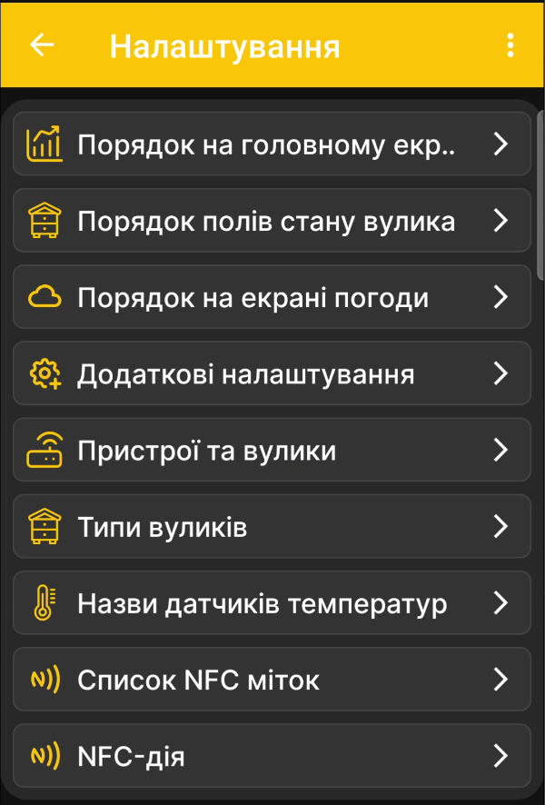

# Налаштування застосунку

Сторінка **Налаштування** є батьківським меню для параметрів відображення та поведінки застосунку. Кожна плашка відкриває окремий дочірній екран.

{ .doc-screenshot }

| Пункт | Призначення |
|---|---|
| **Порядок на головному екрані** | Відкриває [вибір даних і графіків](../chart-settings.md). Саме ці налаштування визначають наявність і порядок плиток на головному екрані, а для числових показників — наявність і порядок графіків на екрані графіків. |
| **Порядок полів стану вулика** | Відкриває [налаштування полів стану вулика](../hive-state-settings.md). |
| **Порядок на екрані погоди** | Відкриває [налаштування даних прогнозу погоди](../weather-settings.md). |
| **Додаткові налаштування** | Відкриває [додаткові параметри поведінки застосунку](../additional-settings.md), зокрема показ подій і роботу через Bluetooth. |
| **Пристрої та вулики** | Керує списком профілів. Окремо описано [додавання пасічних ваг BeeApiary](../add-device.md) і [додавання вулика](../add-hive.md); повний опис екрана ще готується. |
| **Типи вуликів** | Відкриває [список типів вуликів](../hive-types.md), які використовуються в господарстві. |
| **Назви датчиків температур** | Дає змогу призначити зрозумілі назви температурним каналам. Докладний опис буде додано після окремого рев'ю екрана. |
| **Список NFC-міток** | Показує [прив'язані через NFC пристрої та вулики](../nfc-settings.md#linked-nfc-tags). |
| **NFC-дія** | Визначає [дію після розпізнавання NFC-мітки](../nfc-settings.md#nfc-action). |

## Пов'язані налаштування

Налаштування самих пасічних ваг через локальний вебінтерфейс описано окремо: [Пряме Wi-Fi-з'єднання з пристроєм](../../system/local-wifi.md#direct-access-point).

- [Налаштувати синхронізацію через Wi-Fi мережу пасіки](../../guides/configure-wifi-sync.md)
- [Налаштувати синхронізацію через Bluetooth](../../guides/configure-bluetooth-sync.md)
