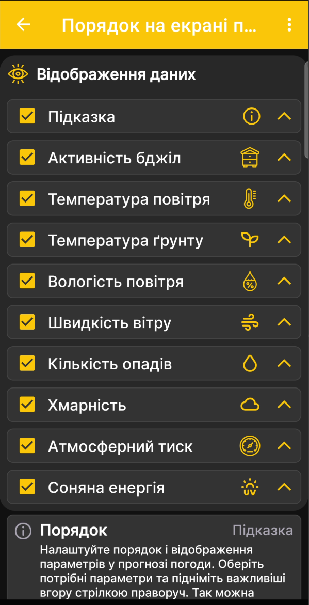

# Порядок даних на екрані погоди

Цей екран визначає, які дані показує прогноз погоди та в якій послідовності вони розташовані.

1. Відкрийте **Головне меню → Налаштування → Порядок на екрані погоди**.
2. Установіть або зніміть прапорці біля потрібних параметрів.
3. За допомогою стрілок праворуч перемістіть найважливіші дані вище.

{ .doc-screenshot }

Доступні підказка, активність бджіл, температура повітря й ґрунту, вологість, швидкість вітру, опади, хмарність, атмосферний тиск і сонячна енергія.

Це налаштування належить прогнозу погоди в Android-застосунку. Воно не вмикає й не вимикає фізичні датчики пасічних ваг BeeApiary.
