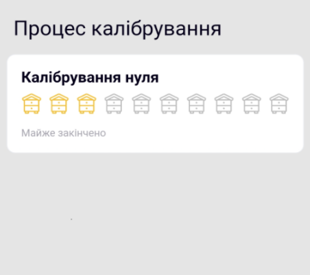
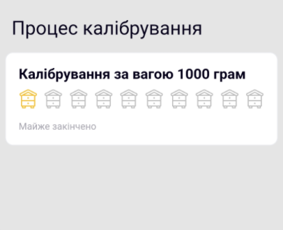

# Калібрування і тарування

!!! danger "Новий пристрій не потрібно калібрувати"
    Калібрування потрібне переважно після ремонту або втрати заводських калібрувальних даних. Не запускайте його як загальний спосіб усунення проблеми з вагою.

## Калібрування

1. Від'єднайте зовнішнє живлення.
2. Установіть усі вагові датчики на твердій горизонтальній поверхні та залиште порожню платформу.
3. Підключіться до локальної мережі Wi-Fi й відкрийте **Загальні налаштування → Налаштування ваги**.

    { .doc-screenshot }

4. Запустіть **Калібрування нуля** й дочекайтеся завершення, не торкаючись платформи.

    Екран показує два етапи калібрування:

    { .doc-screenshot }

    { .doc-screenshot }

5. Виберіть доступний еталон 500, 1000 або 5000 г і покладіть його на платформу.

    { .doc-screenshot }

6. Запустіть **Калібрування за еталоном** і дочекайтеся результату.

    { .doc-screenshot }

    { .doc-screenshot }

## Тарування

Можна ввести відому вагу тари в грамах:

{ .doc-screenshot }

Або прийняти поточну вагу платформи за нуль:

{ .doc-screenshot }

Тарування не змінює заводський коефіцієнт калібрування.

Окремі процедури: [Тарувати ваги](../guides/tare-scales.md) і [Калібрувати ваги](../guides/calibrate-scales.md).
