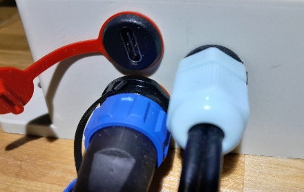

# Живлення та заряджання

Пристрій працює від одного або двох елементів 18650 і заряджається через USB Type-C. Джерелом може бути зарядний пристрій, павербанк або додаткова сонячна панель.

{ .doc-photo }

Після заряджання закрийте захисну кришку роз'єму:

{ .doc-photo }

- блакитний індикатор світиться, коли батарея повністю заряджена й зовнішнє живлення ще підключене;
- заряд відображається в SMS і в загальних налаштуваннях вебінтерфейсу;

  { .doc-screenshot }

- нижче 20% пристрій переходить у режим економії, припиняє звичайні вимірювання та SMS і періодично перевіряє стан заряду;
- після критичного розряду батарея автоматично відключається, а після заряджання може знадобитися [синхронізація часу](../system/time-synchronization.md).

!!! danger
    Не використовуйте пристрій без установленого елемента 18650. Під час заміни суворо дотримуйтеся полярності: неправильна полярність пошкодить пристрій.
