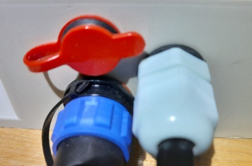

# Живлення та заряджання

Пристрій працює від одного або двох елементів 18650 і заряджається через USB Type-C. Джерелом може бути зарядний пристрій, павербанк або додаткова сонячна панель.

!!! note "Вибір зарядного пристрою та кабелю"
    Пристрій не підтримує швидке заряджання, зокрема USB Power Delivery (PD). Використовуйте звичайне джерело живлення з портом USB Type-A та кабель USB Type-A–USB Type-C. Кабель USB Type-C–USB Type-C для заряджання не рекомендований.

{ .doc-photo }

Після заряджання закрийте захисну кришку роз'єму:

{ .doc-photo }

- блакитний індикатор світиться, коли батарея повністю заряджена й зовнішнє живлення ще підключене;
- заряд відображається в SMS і в загальних налаштуваннях вебінтерфейсу;

  { .doc-screenshot }

- нижче 20% пристрій переходить у режим економії, припиняє звичайні вимірювання та SMS і періодично перевіряє стан заряду;
- після критичного розряду батарея автоматично відключається, а після заряджання може знадобитися [синхронізація часу](../system/time-synchronization.md).

!!! warning "Після тривалого зберігання"
    Якщо напруга батареї нижча за `3,5 В`, не намагайтеся відновити пристрій лише через його USB-роз'єм. Виконайте [процедуру відновлення після тривалого зберігання](../troubleshooting/recovery-after-storage.md).

!!! danger
    Не використовуйте пристрій без установленого елемента 18650. Під час заміни суворо дотримуйтеся полярності: неправильна полярність пошкодить пристрій.
