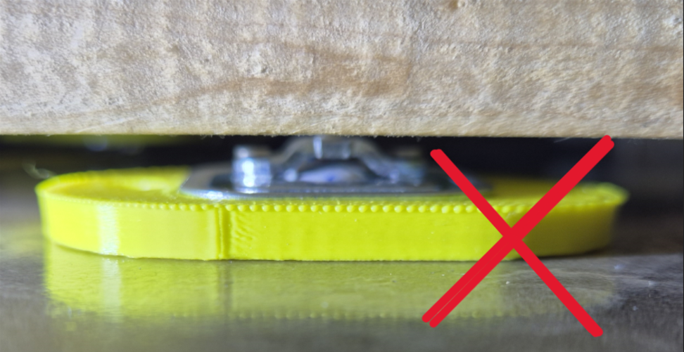
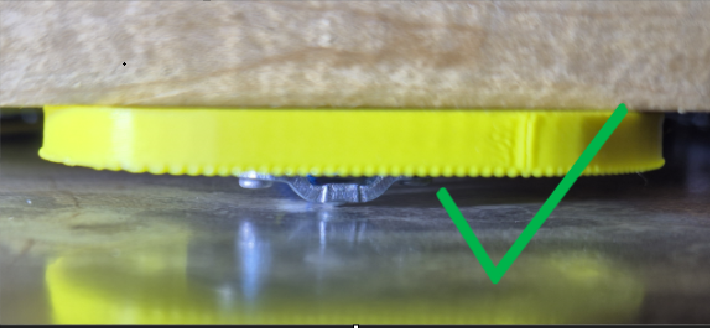

# Датчики

## Вага

Розмістіть чотири вагові датчики під кутами дна вулика. Пластикова частина датчика має бути зверху, а нижня металева опора — стояти на твердій пласкій поверхні. Не ставте датчики безпосередньо на ґрунт або м'яку дерев'яну підкладку. Вулик не повинен хитатися.

Неправильна опора створює перекіс і спотворює вимірювання:

{ .doc-photo }

Датчик має спиратися металевою частиною на тверду пласку поверхню:

{ .doc-photo }

Датчики стійкі до вологи, але не призначені для часткового або повного занурення у воду.

## Температура

Типовий варіант — один датчик усередині або зверху вулика, другий зовні або знизу. Місця можна змінювати відповідно до мети спостереження.

## Додаткові опції

- датчик руху встановлюється збоку основного блока й фіксує рух на відстані 5-7 м у секторі 120-150°;
- OLED-екран показує вагу, температури й заряд батареї та вмикається під час вимірювання або магнітним ключем;
- метеодатчики можуть додавати вологість, тиск і додаткові температури.

Наявність OLED-дисплея, метеодатчика й тривожного входу вказується у [додаткових налаштуваннях пристрою](../system/additional-settings.md).
