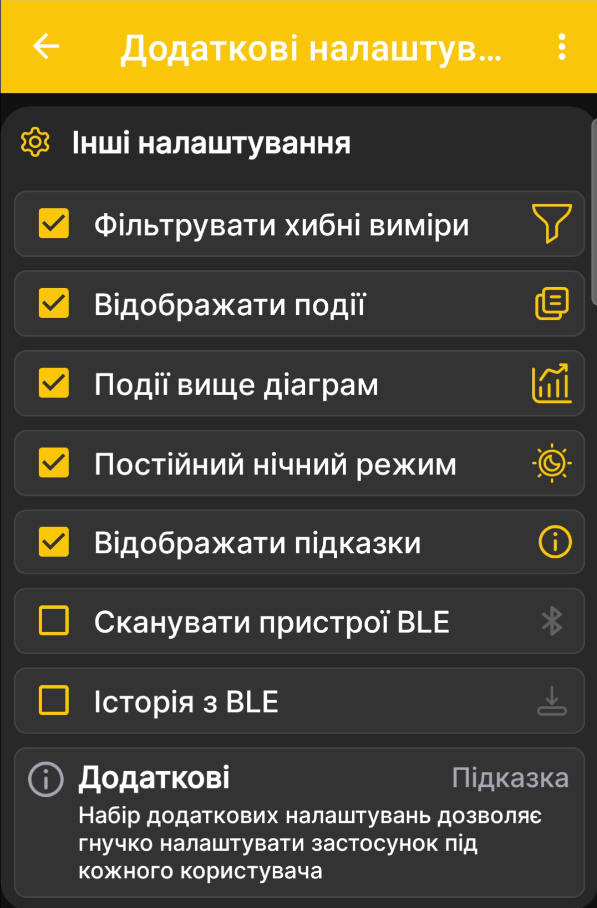

# Як налаштувати синхронізацію через Bluetooth

!!! danger "Сумісність пристрою"
    Ця функція підтримується лише пристроями, виготовленими після серпня 2026 року. Раніше виготовлені пристрої також можуть отримати її, але для цього потрібне оновлення на виробництві. Простого патча для самостійного встановлення наразі немає.

Ця процедура налаштовує автоматичне отримання даних пасічних ваг BeeApiary, коли телефон перебуває поруч. Для синхронізації не потрібні SIM-картка або Інтернет.

## Перед початком

1. Переконайтеся, що пристрій відповідає наведеним вище вимогам сумісності.
2. [Синхронізуйте час пристрою](../system/time-synchronization.md) із телефоном. Розбіжність не повинна перевищувати двох хвилин.
3. Увімкніть Bluetooth на телефоні.
4. Надайте застосунку всі запитані дозволи, зокрема дозволи для Bluetooth.
5. Дозвольте застосунку працювати у фоні й прокидатися у потрібний час. Перевірте чинні [рекомендації зі встановлення застосунку](../app/installation.md).

!!! warning "Перевірте час перед налаштуванням"
    За розбіжності більш ніж на дві хвилини пристрій може вийти на зв'язок раніше або пізніше за телефон, тому автоматична синхронізація не відбудеться.

## Увімкніть BLE info на пристрої

1. [Підключіться до точки доступу пристрою](configure-local-wifi.md).
2. Відкрийте `http://192.168.4.1` і виберіть **Додаткові налаштування**.
3. Установіть прапорець **BLE info** та збережіть зміни.

Призначення цього та інших перемикачів пояснено на сторінці [Додаткові налаштування пристрою](../system/additional-settings.md).

## Увімкніть синхронізацію в застосунку

4. Відкрийте головне меню застосунку, перейдіть до **Налаштування** й відкрийте **Додаткові налаштування**.
5. Увімкніть **Сканувати пристрої BLE**, щоб застосунок міг знаходити пристрій поблизу та отримувати вимірювання.
6. Увімкніть **Історія з BLE**, щоб застосунок також забирав збережену історію, зокрема дані за останню добу.

    { .doc-screenshot }

    !!! warning "Увімкніть потрібні параметри"
        На зображенні наведено загальний приклад екрана, тому обидва Bluetooth-перемикачі показані вимкненими. Для синхронізації **Сканувати пристрої BLE** має бути ввімкнено обов'язково. **Історія з BLE** також бажано ввімкнути, щоб застосунок міг отримувати доступну історію та відновлювати пропущені вимірювання.

    Повний опис параметрів цього екрана наведено на сторінці [Додаткові налаштування застосунку](../app/additional-settings.md).

7. Поверніться на головну сторінку застосунку. Залиште Bluetooth увімкненим і тримайте телефон у зоні впевненого зв'язку з пристроєм під час наступного погодинного циклу.

## Перевірте результат

Синхронізація відбувається, лише коли на вагах увімкнено **BLE info**, а на телефоні активовано Bluetooth і відповідні налаштування застосунку. Ваги стають доступними для обміну під час планового періодичного пробудження або після [активації магнітним ключем](../device/installation.md#activation-reset).

Застосунок може виконати обмін, коли він відкритий, або у фоні, якщо Android дозволяє йому працювати та прокидатися у потрібний час.

8. Дочекайтеся повідомлення про отримані дані.

    { .doc-screenshot }

    У цьому вікні відображаються:

    - назва вулика та номер пасічних ваг;
    - останній доступний набір вимірювань відповідно до конфігурації ваг;
    - дата й час отриманого вимірювання;
    - час і результат синхронізації годинника.

    Під час першого з'єднання з іще не зареєстрованими вагами у вікні може додатково з'явитися кнопка **Додати пристрій**. Скористайтеся нею та один раз виконайте стандартну процедуру [додавання пасічних ваг](../app/add-device.md). Надалі застосунок розпізнаватиме їх автоматично.

9. Натисніть **OK**. За потреби повторно відкрийте останнє повідомлення через пункт **BLE Info** у головному меню.
10. Перевірте, що нові значення з'явилися на головній сторінці та графіках застосунку.

Готово: коли телефон перебуває поруч, застосунок автоматично отримуватиме доступні дані. Якщо зв'язок був відсутній кілька годин, увімкнена **Історія з BLE** дає змогу відновити пропущені вимірювання під час наступної успішної синхронізації в межах доступної історії від доби до тижня.

Докладніше про принцип роботи: [Синхронізація даних через Bluetooth](../system/bluetooth.md).
