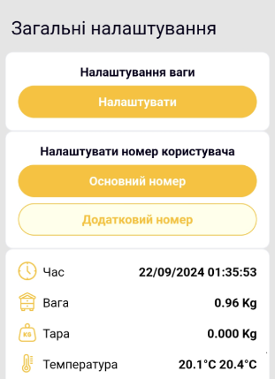
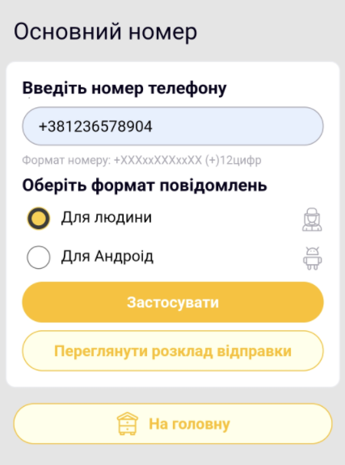

# Як налаштувати GSM

1. Переконайтеся, що micro-SIM активна, має покриття й не захищена PIN-кодом.
2. Підключіться до [локальної мережі Wi-Fi](configure-local-wifi.md).

    На сторінці загальних налаштувань доступні кнопки основного й додаткового номера:

    { .doc-screenshot }

3. Відкрийте налаштування **Основний номер** або **Додатковий номер**.

    { .doc-screenshot }

    { .doc-screenshot }

4. Введіть номер у форматі `+380XXXXXXXXX`.
5. Виберіть звичайний або стислий формат SMS.
6. Відкрийте розклад, виберіть години й натисніть **Створити та зберегти**.
7. Від'єднайтеся від `apiary_net` і дочекайтеся першого SMS.

    Після збереження номер відображається у вебінтерфейсі:

    { .doc-screenshot }

    { .doc-screenshot }

Щоб прибрати номер, задайте `+000000000000`. Формати й розклад описані на сторінці [GSM та SMS](../system/gsm-and-sms.md).
