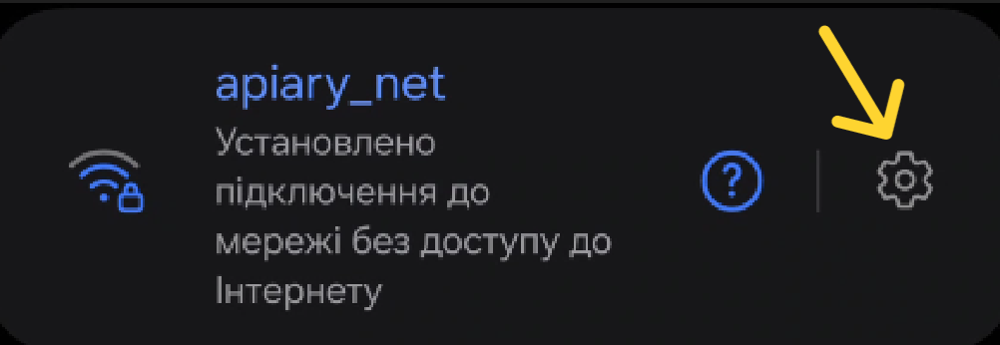
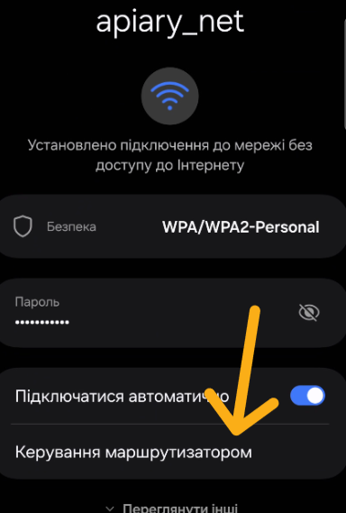

# Як підключитися до локальної мережі Wi-Fi

1. [Активуйте або перезапустіть вимірювальний пристрій BeeApiary](../device/installation.md#activation-reset): коротко піднесіть магнітний ключ до фірмової позначки на зворотному боці основного блока.
2. Протягом хвилини відкрийте Wi-Fi на телефоні, планшеті або ноутбуці.

    { .doc-screenshot }

3. Підключіться до `apiary_net` з початковим паролем `apiary_wifi`.

    { .doc-screenshot }

4. Відкрийте `http://192.168.4.1`.
5. Перевірте, що відкрилася головна сторінка пристрою.
6. Після першої перевірки змініть SSID або пароль у мережевих налаштуваннях.

Якщо не встигли підключитися, повторіть те саме коротке піднесення ключа до фірмової позначки. Докладніше: [Локальна мережа Wi-Fi](../system/local-wifi.md).
