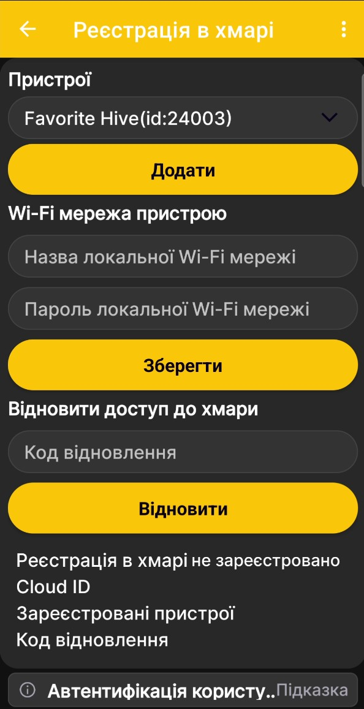
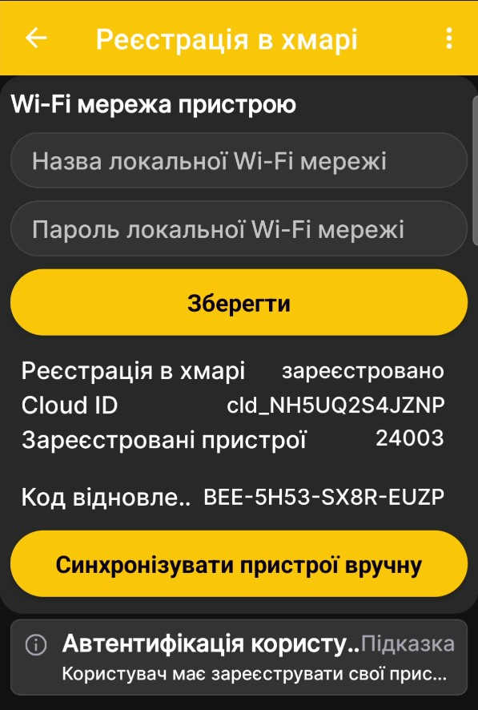
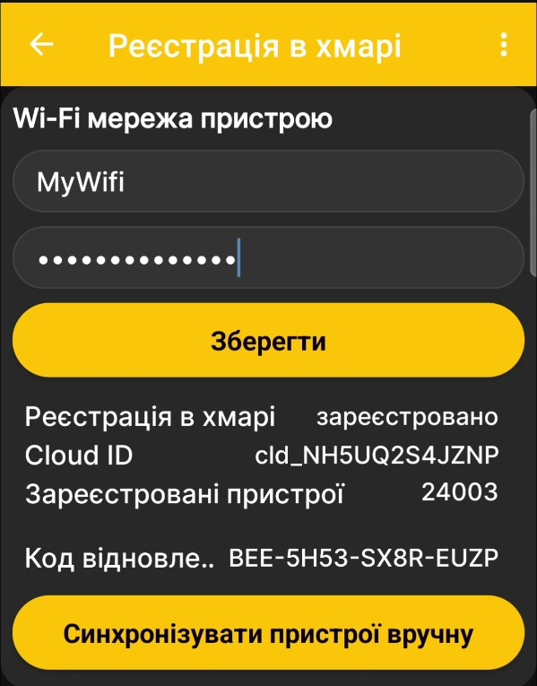
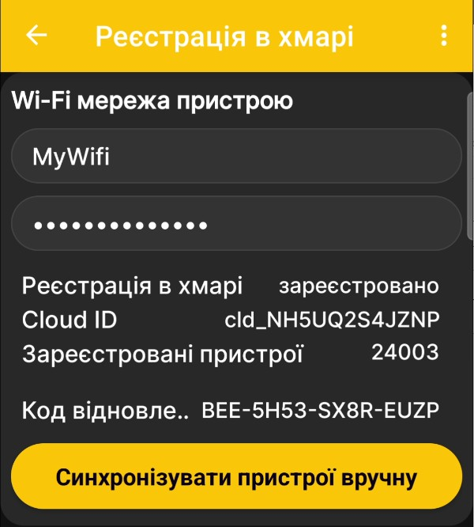
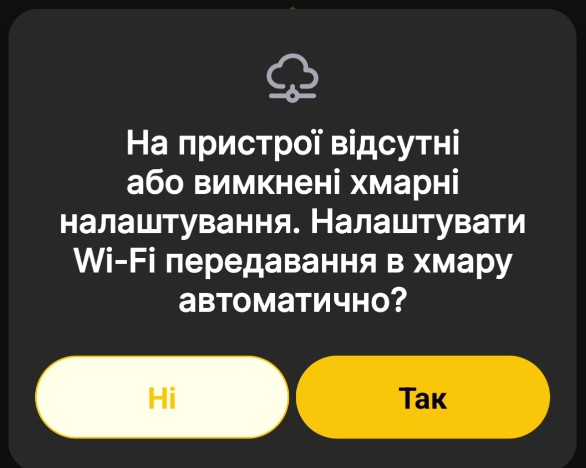

# Як налаштувати синхронізацію через Wi-Fi мережу пасіки

!!! danger "Сумісність пристрою"
    Ця функція підтримується лише пристроями, виготовленими після серпня 2026 року. Раніше виготовлені пристрої також можуть отримати її, але для цього потрібне оновлення на виробництві. Простого патча для самостійного встановлення наразі немає.

Ця процедура дає пристрою змогу автоматично передавати дані до застосунку через доступну на пасіці Wi-Fi мережу з Інтернетом. Після налаштування телефон може перебувати будь-де, де має доступ до Інтернету, а окрема SIM-картка для пристрою не потрібна.

!!! danger "Додаткова функція: не використовуйте як єдиний канал"
    Цей спосіб синхронізації залежить від зовнішнього транзитного сервісу. Зі зростанням навантаження або після виходу за межі безоплатного трафіку сервіс може тимчасово працювати нестабільно, бути обмежений або стати платним. Не розраховуйте на нього як на єдиний основний канал отримання даних. Зберігайте можливість отримати дані через GSM, Bluetooth, пряме Wi-Fi-з'єднання з пристроєм або microSD.

!!! note "Перед початком"
    - Пристрій уже має бути доданий до застосунку BeeApiary.
    - Застосунок повинен хоча б раз отримати дані цього пристрою через SMS або пряме завантаження архіву.
    - Телефон повинен мати доступ до Інтернету під час реєстрації.
    - Біля пристрою має бути доступна Wi-Fi мережа з Інтернетом. Підготуйте її назву та пароль.

## Зареєструйте пристрій у застосунку

Під час цієї частини підключення до самого пристрою не потрібне.

1. Відкрийте головне меню застосунку й виберіть **Реєстрація в хмарі**.

    { .doc-screenshot }

2. У полі **Пристрої** виберіть потрібний пристрій і натисніть **Додати**.

    { .doc-screenshot }

3. Переконайтеся, що пристрій зник зі списку додавання та з'явився серед зареєстрованих.

    { .doc-screenshot }

    Після успішної реєстрації застосунок показує:

    - стан **Реєстрація в хмарі — зареєстровано**;
    - `Cloud ID` цієї реєстрації;
    - номер у переліку **Зареєстровані пристрої**;
    - код відновлення доступу до реєстрації.

    Сервіс також формує ключі, потрібні для подальшої взаємодії з пристроєм. Кнопка **Синхронізувати пристрої вручну** для звичайного початкового налаштування не потрібна.

## Задайте мережу пасіки

4. У блоці **Wi-Fi мережа пристрою** введіть назву й пароль Wi-Fi мережі, доступної біля пристрою, а потім натисніть **Зберегти**.

    { .doc-screenshot }

5. Після збереження кнопка **Зберегти** зникає. Це означає, що введені параметри збережені в застосунку й підготовлені до передавання пристрою.

    { .doc-screenshot }

    Якщо змінити назву мережі або пароль, кнопка з'явиться знову. Натисніть її, щоб зберегти нові значення.

6. Натисніть стрілку назад. Застосунок повідомить, що реєстрацію збережено, але налаштування ще потрібно записати у пристрій.

    { .doc-screenshot }

## Передайте налаштування пристрою

7. [Підключіть телефон до точки доступу пристрою](../quick-start/local-wifi.md): активуйте або перезапустіть пристрій магнітним ключем, підключіться до `apiary_net` і переконайтеся, що відкривається головна сторінка вебінтерфейсу пристрою.
8. Не від'єднуючись від `apiary_net`, поверніться до застосунку BeeApiary.
9. Коли застосунок покаже запит **«Пристрій поруч. Завантажити архів?»**, натисніть **Так** і дочекайтеся завершення завантаження.

    { .doc-screenshot }

10. Погодьтеся автоматично записати Wi-Fi- та хмарні налаштування у пристрій.

    { .doc-screenshot }

11. Дочекайтеся повідомлення про успішний запис налаштувань.

    { .doc-screenshot }

12. Від'єднайте телефон від `apiary_net`.
13. Щоб застосувати налаштування одразу, [перезапустіть пристрій магнітним ключем](../device/installation.md#activation-reset). Також можна не перезапускати його й дочекатися наступного запланованого годинного циклу.

Готово: під час наступного циклу пристрій підключиться до заданої Wi-Fi мережі й почне автоматично передавати дані до застосунку.

!!! note "Необов'язкова локальна перевірка"
    Зазвичай додаткові дії не потрібні. За потреби можна [перевірити збережені налаштування синхронізації через вебінтерфейс пристрою](verify-wifi-sync-settings.md), не змінюючи інших параметрів.

Принцип роботи й умови зберігання даних описано в розділі [Wi-Fi-з'єднання пристрою](../system/local-wifi.md#apiary-wifi-routing).
