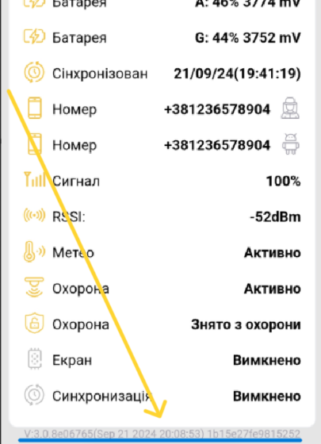
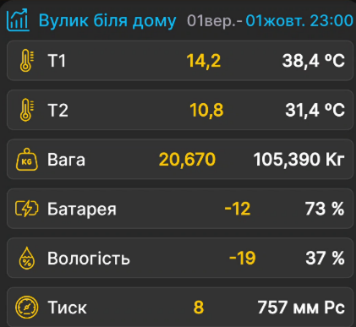

# Як завантажити архів

1. [Активуйте або перезапустіть вимірювальний пристрій BeeApiary](../device/installation.md#activation-reset) магнітним ключем.
2. Підключіть телефон до `apiary_net` і залишайтеся поруч із пристроєм.
3. Відкрийте застосунок BeeApiary.
4. Відкрийте налаштування відповідного пристрою.

    { .doc-screenshot }

5. Запустіть завантаження річного архіву й дочекайтеся завершення зв'язку.

    Перед завантаженням можна звірити безпосередні показники пристрою:

    { .doc-screenshot }

    Підтвердьте завантаження, коли застосунок знайде пристрій поруч:

    { .doc-screenshot }

6. Від'єднайтеся від `apiary_net`.
7. Перегляньте завантажені дані стандартними засобами застосунку.

Результат: застосунок має локальну копію вимірювань із пристрою. Формат локального архіву описано в [Зберіганні даних](../system/data-storage.md).
